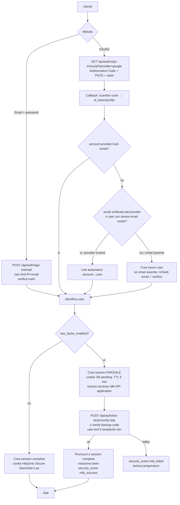
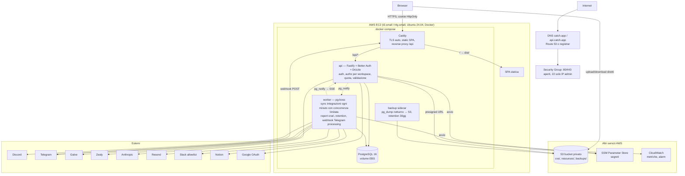

# Catch — Audit tecnico e piano di refactoring / migrazione

**Data:** 21 agosto 2026
**Perimetro:** repository `catch` (31.701 righe in `src/`, 2.842 in `supabase/functions/`, 3.014 righe SQL in 27 migrazioni, 2 funzioni Vercel in `api/`) e `Catch-Business-Plan.pdf` (14 agosto 2026).
**Stato:** documento di sola analisi. **Nessuna modifica al codice è stata effettuata.** Le modifiche partono solo dopo l'approvazione delle decisioni elencate nella sezione 16.

Ogni affermazione di questo documento è riferita a un file e, dove utile, a una riga (`file:riga`). Dove qualcosa non è deducibile dal codice (es. configurazione del progetto Supabase non versionata) è dichiarato esplicitamente.

---

## Indice

1. [Executive Summary](#1-executive-summary)
2. [Comprensione del prodotto](#2-comprensione-del-prodotto)
3. [Architettura attuale](#3-architettura-attuale)
4. [Confronto Business Plan vs Codice](#4-confronto-business-plan-vs-codice)
5. [Problemi trovati](#5-problemi-trovati)
6. [Audit sicurezza](#6-audit-sicurezza)
7. [Architettura di autenticazione consigliata](#7-architettura-di-autenticazione-consigliata)
8. [Nuova architettura consigliata](#8-nuova-architettura-consigliata)
9. [Mappa di sostituzione Vercel/Supabase](#9-mappa-di-sostituzione-vercelsupabase)
10. [Strategia database](#10-strategia-database)
11. [Piano di refactoring](#11-piano-di-refactoring)
12. [Piano di migrazione](#12-piano-di-migrazione)
13. [Piano di deployment EC2](#13-piano-di-deployment-ec2)
14. [Roadmap](#14-roadmap)
15. [Stima della complessità](#15-stima-della-complessità)
16. [Decisioni che richiedono la tua approvazione](#16-decisioni-che-richiedono-la-tua-approvazione)
- [Appendice A — Testing](#appendice-a--strategia-di-testing)
- [Appendice B — DevOps e operatività](#appendice-b--devops-e-operatività)
- [Appendice C — Inventario environment variables](#appendice-c--inventario-environment-variables)

---

## 1. Executive Summary

1. **Il prodotto è un SaaS multi-workspace per community manager Web3**: raccolta metriche (Discord, Telegram, Galxe, Zealy, X via CSV), gestione moderatori/turni/compensi, task, risorse, report al cliente. Zero clienti paganti, 15 in lista d'attesa. Il Business Plan colloca il prodotto a TRL 7 e chiede **consolidamento, non nuove feature**.
2. **L'architettura attuale è "Supabase-centrica" al 100%**: il browser parla direttamente con PostgreSQL via PostgREST; l'unico livello di autorizzazione è la Row Level Security; 16 edge function Deno fanno ingestione; pg_cron fa lo scheduling; Supabase Auth (Google) gestisce le identità; Vercel serve solo la SPA statica più due endpoint webhook accessori. **Non esiste un backend applicativo.** Questa è la conseguenza più rilevante per la migrazione: non si tratta di "spostare un backend", ma di **costruirne uno** che oggi non c'è.
3. **Vercel è una dipendenza debole** (hosting statico + 2 webhook marginali, uno dei quali — Fathom→Notion — non appartiene al prodotto). **Supabase è una dipendenza forte** (DB, Auth, Storage, Realtime, Edge Functions, pg_cron, pg_net).
4. **Sicurezza — problemi gravi da risolvere prima di ogni migrazione**: (a) le credenziali delle integrazioni (bot token Discord/Telegram, API key Zealy, token Notion) sono in chiaro in `integrations.credentials` e **leggibili dal browser** del proprietario, contrariamente a quanto afferma il Business Plan (§6.1); (b) l'utente può **promuoversi al piano Enterprise** con un `UPDATE` sulla propria riga `profiles` (nessun vincolo DB, policy senza restrizione di colonna) e anche via `localStorage.catch:planOverride`; (c) `send-report-webhook` effettua `fetch` verso un URL fornito dall'utente senza allowlist → **SSRF**, che su EC2 raggiunge il metadata service; (d) `status-update` chiama Anthropic con modello Opus senza quota né limite di dimensione input → **costo illimitato per utente autenticato**; (e) qualunque utente può programmare email giornaliere dal dominio Catch verso **qualsiasi indirizzo** (spam/phishing brandizzato).
5. **Autorizzazione implicita ovunque**: nessuna edge function verifica esplicitamente che `workspace_id` appartenga al chiamante; si affida a RLS. Le tabelle hanno `GRANT ALL ... TO anon` per default. Funziona oggi solo perché le policy sono scritte bene; non sopravvive alla migrazione se non si riscrive l'autorizzazione nel backend.
6. **Il ruolo "admin" è una stringa email hardcoded** (`cinicololuca@gmail.com`) in 2 file client, 1 edge function e 3 migrazioni SQL.
7. **Autenticazione**: Supabase Auth, UI Google-only, flusso OAuth `implicit` (token nell'URL fragment, senza PKCE). Email/password esiste in `AuthContext` ma non ha UI. Nessuna MFA. Configurazione Auth (verifica email, rate limit, conferma cambio email) **non versionata** e non verificabile dal repo.
8. **Qualità del codice**: buona tipizzazione (2 `any` in totale), logica di dominio in `src/lib` separata dalla UI, naming decente. Ma: componenti da 600–1500 righe (`Analytics.tsx` 1539), 1.271 righe di file orfani, helper duplicati fino a 7 volte (`initialsOf`), logica di sincronizzazione duplicata tra `*-sync` e `cron-sync`, 17 `catch` silenziosi, dati di business in `localStorage` (storico report, meta task, CSV X) che non sopravvivono a un cambio browser.
9. **Dati mock mescolati alla produzione**: `Analytics.tsx` ripiega su `getStats()` mock quando non ci sono dati live; il trend messaggi è **sempre** mock (`Analytics.tsx:746`); `Leaderboard` è interamente generata da PRNG anche per workspace reali; le statistiche moderatore hanno baseline hardcoded (`rating: 5`). Questo contraddice il principio fondante "solo metriche verificabili".
10. **Zero test automatici**; il gate di regressione è `tsc -b && vite build`. Il Business Plan lo riconosce come prerequisito del modello di crescita.
11. **Repository non sotto Git** (confermato: nessuna `.git`), deploy da macchina locale, `supabase/.temp/` con project ref e URL del pooler committati nella cartella.
12. **Raccomandazione architetturale**: SPA React invariata nel front, **nuovo backend Node/TypeScript (Fastify) + Drizzle ORM + PostgreSQL**, **Better Auth** per email/password + OAuth multi-provider + account linking + TOTP + passkey (libreria consolidata, self-hosted, DB-backed), **worker** separato con **pg-boss** (coda su Postgres, niente Redis) per cron/sync/report, **S3** per i file con URL firmati, **SSE** opzionale per realtime (polling come floor), tutto in **Docker Compose su una EC2** dietro **Caddy** (HTTPS automatico).
13. **Database**: PostgreSQL nel Compose sulla stessa EC2 per MVP (backup notturni `pg_dump` su S3 + test di restore mensile); passaggio a **RDS** quando ci sono clienti paganti con dati importanti. Schema: riusare le migrazioni esistenti ripulite (via Drizzle migrations), rimuovere la dipendenza da `auth.*`, cifrare le credenziali.
14. **Migrazione utenti**: gli UUID vanno preservati (tutto pende da `profiles.id`). Gli utenti Google si ri-collegano automaticamente tramite lo stesso `sub` Google se si riusa lo stesso OAuth client. Gli hash password Supabase sono bcrypt ed esportabili: Better Auth può verificarli con un hasher custom; in alternativa reset obbligatorio. Dato che la UI è Google-only, il numero di utenti con password è probabilmente ~0 (da verificare con una query — Fase A).
15. **Sequenza proposta**: Fase A (audit/preparazione, Git) → Fase B (fix P0 sulla piattaforma attuale, test sul dominio puro) → Fase C (EC2 + Compose + Caddy) → Fase D (DB) → Fase E (backend + auth) → Fase F (storage, jobs, webhook) → Fase G (staging, E2E) → Fase H (go-live con DNS switch e rollback verso Supabase mantenuto in sola lettura per 30 giorni). Stima complessiva: **L** (8–12 settimane/persona), di cui il backend + auth è la parte dominante.

---

## 2. Comprensione del prodotto

Sintesi tecnica derivata da `Catch-Business-Plan.pdf`.

### 2.1 Obiettivo e problema

Catch è un "centro di comando" per chi gestisce community Web3. Il problema: metriche frammentate su più piattaforme, team di moderatori distribuiti su fusi diversi, compensi calcolati a mano, report costruiti manualmente. Il vincolo identitario del prodotto: **espone solo metriche verificabili**; se un dato non è ricavabile dalle integrazioni viene omesso o marcato indisponibile, mai stimato (matrice di capacità in `src/lib/analyticsCapabilities.ts`).

### 2.2 Utenti target

- **B2C**: community manager con un cliente, social media manager, founder, CM freelance.
- **B2B**: agenzie marketing Web3/crypto con più clienti e team di moderatori; richiedono più workspace, più postazioni, report brandizzati.
- Mercati: USA, Europa, Brasile (landing già in EN/PT).
- Piani: Starter / Pro / Agency / Enterprise, prezzi "contattaci" (nessun billing nel prodotto).

### 2.3 Use case e flussi principali

1. Registrazione → onboarding (nome progetto, piattaforme) → creazione workspace.
2. Collegamento integrazioni (Discord bot, Telegram bot, Galxe alias, Zealy key) → sync automatico ogni minuto.
3. Consultazione analytics con finestre temporali governate dalla matrice di capacità; import CSV per X.
4. Gestione moderatori: anagrafica, CV, turni UTC, copertura 24h, puntualità, warning.
5. Compensi a punti: catalogo metriche → punti → tasso → valuta; registro pagamenti (nessun movimento di denaro).
6. Operatività: task (tabella/board/calendario), risorse a cartelle, riunioni.
7. Report al cliente: generazione, invio programmato via email, Slack, Notion.
8. Catch Intelligence: chat deterministica a keyword + riepilogo generativo (Anthropic) sui numeri già calcolati.
9. Ascolto menzioni su reti aperte (Bluesky, Nostr, Snapshot) dal browser.

### 2.4 Funzionalità core (dal BP)

Misurare · Gestire il team · Retribuire · Operare · Rendicontare.

### 2.5 Dati gestiti

- Identità utenti (email, nome, piano).
- **Credenziali di terze parti** per workspace (bot token, API key, token Notion, webhook Slack).
- Metriche aggregate per piattaforma (giornaliere + snapshot orari).
- **Dati personali di membri delle community**: Telegram user id + username/nome, Discord member id + data di ingresso (conteggio messaggi per membro; testo dei messaggi mai conservato).
- **Dati personali dei moderatori**: nome, handle, paese, tariffa, CV in PDF + testo estratto, warning.
- Pagamenti (importi, valute, note).
- Risposte al discovery form pubblico (nome, email, ruolo, risposte libere, user agent).
- Feedback utenti.

### 2.6 Integrazioni esterne

Discord REST, Telegram Bot API + webhook, Galxe GraphQL, Zealy REST, Bluesky/Nostr/Snapshot pubbliche, Anthropic, Resend (email), Slack incoming webhook, Notion API, Google Sheets (export), Microsoft Clarity (analytics, consent-gated), Google OAuth. Non nel BP ma presente nel repo: Fathom→Notion (`api/fathom-webhook.ts`), Cal.com link nel discovery form.

### 2.7 Requisiti di privacy e sicurezza (dal BP)

- Isolamento per workspace applicato dal database (§2.1, §6.1).
- Credenziali delle integrazioni "mai esposte all'interfaccia" (§4, §6.1) — **non rispettato nel codice**, vedi S-01.
- Testo dei messaggi non archiviato (§4.2, §6.1) — rispettato.
- Chiave Anthropic mai nel browser (§9.2) — rispettato.
- Governo del costo LLM: elenco chiuso operazioni, tetto per operazione, quota per piano, tetto fornitore (§9.3) — solo il primo è implementato.
- Non menzionati nel BP ma necessari per un SaaS con PII di terzi (membri Telegram/Discord, CV moderatori): base giuridica GDPR, DPA con i clienti, retention, cancellazione account.

### 2.8 Scalabilità

Il BP stima ~3.500 righe snapshot/giorno/workspace. Con 100 workspace: ~350k righe/giorno, ~10M/mese su `platform_metric_snapshots` senza retention attiva (la retention a 30 giorni è **commentata** in `011:27` e `025:91`). Il cron al minuto itera tutti i workspace in parallelo senza limite di concorrenza. Il modello regge decine di workspace; oltre serve coda con concorrenza limitata e retention.

### 2.9 Funzionalità previste ma non implementate o inerti

- Invio email report (manca `RESEND_API_KEY`, HANDOVER §4).
- Eventi membership Telegram (webhook non registrato con `chat_member`).
- Migrazioni 023–027 non applicate in produzione (HANDOVER §4).
- Quota LLM per piano, tetto per operazione, registrazione consumi (`usage_events` esiste ma nessun writer per l'LLM).
- Discord realtime via Gateway (rinviato consapevolmente).
- Report brandizzati per agenzie, più postazioni per workspace (multi-utente) — B2B: **nessuna traccia nello schema** (un workspace ha un solo `owner_id`).
- Zealy leaderboard per utente (margine dichiarato).

### 2.10 Funzionalità rimandabili (proposta)

In coerenza con BP §12.1 ("prodotto vendibile, non definitivo"), sono candidate a rinvio post-migrazione: Leaderboard (oggi mock), Listening (nessuna storicizzazione, valore limitato), Fathom→Notion, Google Sheets export, Microsoft Clarity, Snapshot/Nostr, multi-postazione B2B, passkey. La migrazione dovrebbe portare in produzione il perimetro **effettivamente usato** e non il perimetro "completo su interfaccia".

---

## 3. Architettura attuale

Descrive solo ciò che è presente nel repository.

### 3.1 Stack

| Livello | Tecnologia | Evidenza |
|---|---|---|
| Linguaggio | TypeScript 6 (strict, `noUnusedLocals`) ovunque; SQL | `tsconfig.app.json`, `supabase/migrations` |
| Frontend | React 19, Vite 8, Tailwind 4, React Router 7, Recharts 3, Framer Motion, lucide-react | `package.json` |
| Backend applicativo | **Assente**. Il browser usa `@supabase/supabase-js` direttamente contro PostgREST | `src/lib/db.ts` (45 `supabase.from`), `dbPlatformV2.ts` (20), `resourceFolders.ts` (9) ecc. |
| Funzioni server | 16 Supabase Edge Functions (Deno) | `supabase/functions/*` |
| Endpoint Vercel | 2 serverless (`api/discovery-notify.ts`, `api/fathom-webhook.ts`) | `api/` |
| Database | PostgreSQL (Supabase), 32 tabelle, 27 migrazioni, RLS su tutte | `supabase/migrations` |
| Auth | Supabase Auth; Google OAuth (implicit flow); email/password presente in `AuthContext` senza UI | `src/lib/supabase.ts:29`, `src/context/AuthContext.tsx`, `src/pages/Login.tsx`, `src/pages/Signup.tsx:3` |
| Storage | Supabase Storage, bucket privati `cvs` e `resources`, URL firmati 300 s | `src/lib/dbPlatformV2.ts:84-96,357-378`, `016:200-243` |
| Realtime | Supabase Realtime `postgres_changes` su 8 tabelle, debounce 500 ms, polling 5 min come floor | `src/hooks/useRealtimeTables.ts`, `027` |
| Scheduling | pg_cron + pg_net → HTTP POST alle edge function con `x-cron-secret` | `009`, `014`, `025` |
| Background jobs | Nessuna coda; il lavoro è fatto dentro la richiesta HTTP del cron | `cron-sync/index.ts:489` |
| Email | Resend (edge `send-report`, Vercel `discovery-notify`) | |
| LLM | Anthropic via edge `status-update` | |
| Hosting | Vercel (SPA, `vercel.json` rewrite SPA) | |
| Lint | oxlint | |
| Test | Nessuno | |
| VCS | Nessun repository Git | `ls -la` |

### 3.2 Struttura del progetto

```
src/
  App.tsx                 routing (lazy routes, ProtectedRoute)
  context/                Auth, Workspace, Theme, Timezone, Toast
  i18n/                   EN/PT solo per la landing
  lib/                    dominio + data access (db.ts, dbPlatformV2.ts, analyticsCapabilities.ts, reportBuilder.ts, chatEngine.ts, ...)
  hooks/                  useRealtimeTables, useSupabaseData, useCurrentPlan, useReportHistory (localStorage)
  components/layout       Sidebar, TopBar, MainLayout
  components/modules/*    un file/cartella per sezione (Analytics 1539 righe, Resources 696, Report 642, ...)
  components/ui           primitive
  pages/                  Landing, Login, Onboarding, Profile, Forgot/ResetPassword, discovery/DiscoveryForm (pubblico)
  data/                   mockData, moderatorsData, leaderboardData, instructionsData, discoveryQuestions
supabase/
  migrations/             001..027 (manca 008, 021 duplicato)
  functions/              16 edge function Deno + _shared
  .temp/                  project-ref, pooler-url (committati)
api/                      2 funzioni Vercel
docs/                     2 HTML generati
```

### 3.3 Routing e API

- Routing client: `App.tsx`. Pubbliche: `/`, `/landing`, `/discovery[/:slug]`, `/login`, `/signup`, `/forgot-password`, `/reset-password`. Protette: `/onboarding`, `/dashboard/*` (17 sezioni + profile).
- "API": PostgREST (tutte le 31 tabelle citate dal client), `supabase.functions.invoke` per 10 funzioni integrazione + `status-update` + `admin-analytics` + `discord-members-sync`; Storage API; Realtime WS.
- Endpoint HTTP esterni: `telegram-webhook`, `cron-sync`, `send-report`, `send-report-webhook` (segreti condivisi), `api/discovery-notify` (Supabase DB webhook), `api/fathom-webhook`.

### 3.4 Gestione dello stato

Context React (Auth, Workspace, Toast, Theme, Timezone, Language) + stato locale per modulo. Nessuna libreria di data fetching: ogni modulo riscrive `let cancelled = false; setLoading(...)` (23 file). **localStorage** ospita stato di business: `catch:reportHistory` (storico report, max 20/workspace), `catch:taskmeta:*` (colonne Area/Start dei task), `catch:xanalytics:*` (CSV X importato), `catch:localWorkspaces` (workspace guest), `catch:planOverride` (override piano), bozze discovery, consenso, tema, lingua, sidebar.

### 3.5 Code path server vs client

- **Client**: tutto il CRUD applicativo, calcolo compensi, costruzione report (HTML generato in `reportBuilder.ts`), parsing CSV X, parsing PDF CV (`pdfjs-dist`), chiamate a Bluesky/Nostr/Snapshot/Google Sheets, upload file.
- **Server (edge)**: validazione credenziali integrazioni, sync metriche, webhook Telegram, cron, report email/Slack/Notion, chiamata Anthropic, analytics admin.
- **Server (Vercel)**: notifica email discovery, Fathom→Notion.
- **DB**: trigger `handle_new_user` (profilo alla registrazione), 3 funzioni SQL `bump_*`/`record_*`, pg_cron.

### 3.6 Variabili d'ambiente e configurazione

Client (`VITE_*`): `VITE_SUPABASE_URL`, `VITE_SUPABASE_PUBLISHABLE_KEY`, `VITE_GOOGLE_CLIENT_ID`, `VITE_CLARITY_PROJECT_ID`. Edge: `SUPABASE_URL/ANON_KEY/SERVICE_ROLE_KEY`, `CRON_SECRET`, `TELEGRAM_WEBHOOK_SECRET`, `RESEND_API_KEY`, `REPORT_FROM_EMAIL`, `ANTHROPIC_API_KEY`, `STATUS_UPDATE_MODEL`. Vercel: `RESEND_API_KEY`, `DISCOVERY_WEBHOOK_SECRET`, `NOTIFY_TO_EMAIL`, `NOTIFY_FROM_EMAIL`, `APP_URL`, `NOTION_TOKEN`, `NOTION_DATABASE_ID`, `FATHOM_WEBHOOK_SECRET`. Inventario completo in Appendice C. Nessun `supabase/config.toml` → configurazione Auth/verify_jwt non versionata.

### 3.7 Diagramma dell'architettura attuale

```mermaid
flowchart TB
  subgraph Browser["Browser — SPA React (Vercel CDN)"]
    UI[Componenti moduli]
    LIB[src/lib: db.ts, dbPlatformV2.ts, reportBuilder, chatEngine]
    LS[(localStorage: reportHistory, taskmeta, xanalytics, planOverride)]
    UI --> LIB
    UI --> LS
  end

  subgraph Vercel
    V1[/api/discovery-notify/]
    V2[/api/fathom-webhook/]
  end

  subgraph Supabase
    AUTH[Supabase Auth<br/>Google implicit flow]
    REST[PostgREST<br/>RLS = unica autorizzazione]
    RT[Realtime WS<br/>postgres_changes 8 tabelle]
    ST[Storage<br/>bucket cvs, resources]
    subgraph PG[(PostgreSQL)]
      T[32 tabelle public<br/>credentials jsonb in chiaro]
      AU[auth.users / identities]
      CRON[pg_cron + pg_net<br/>ogni minuto / ogni ora]
    end
    subgraph EF["Edge Functions (Deno) ×16"]
      CONN[*-connect ×4]
      SYNC[*-sync ×6]
      CS[cron-sync]
      SR[send-report / send-report-webhook]
      TW[telegram-webhook]
      SU[status-update]
      AA[admin-analytics]
    end
  end

  subgraph Ext["Servizi esterni"]
    DC[Discord API]
    TG[Telegram Bot API]
    GX[Galxe GraphQL]
    ZL[Zealy API]
    AN[Anthropic]
    RS[Resend]
    SL[Slack webhook]
    NO[Notion]
    BS[Bluesky / Nostr / Snapshot]
    GS[Google Sheets GIS]
  end

  LIB -->|supabase-js JWT| REST
  LIB --> AUTH
  LIB --> RT
  LIB --> ST
  LIB -->|functions.invoke| CONN & SYNC & SU & AA
  UI --> BS
  UI --> GS
  REST --> T
  AUTH --> AU
  AU -->|trigger handle_new_user| T
  CRON -->|http_post x-cron-secret| CS & SR
  CS --> DC & TG & GX & ZL
  SYNC --> DC & TG & GX & ZL
  CONN --> DC & TG & GX & ZL
  CS -->|service role| T
  TG -->|webhook secret| TW --> T
  SU --> AN
  SR --> RS & SL & NO
  T -->|DB webhook INSERT discovery_responses| V1 --> RS
  V2 --> NO
```

---

## 4. Confronto Business Plan vs Codice

Legenda stato: **I** Implementato · **P** Parzialmente · **N** Non implementato · **?** Non chiaro · **D** Implementato diversamente.

| Requisito / Funzionalità (BP) | Stato | Note (evidenza) |
|---|---|---|
| SPA React su Vercel, 5 livelli | I | |
| Isolamento per workspace applicato dal DB (RLS) | I | Tutte le 32 tabelle con RLS; policy `owner_id = auth.uid()`; manca però vincolo cross-tabella moderator↔workspace (§6 R-25) |
| Auth via Google | I | `AuthContext.signInWithGoogle`, implicit flow |
| Auth email/password | D | Codice in `AuthContext.login/signup` ma nessuna UI (`Signup.tsx:3` "Auth is Google-only"); `ForgotPassword`/`ResetPassword` esistono |
| Credenziali integrazioni mai esposte al browser | **D** | Leggibili via PostgREST dal proprietario (`001:59-64` policy `for all`, nessuna restrizione colonna) |
| Discord connect/sync/messages/members | I | 4 edge function + duplicato in `cron-sync` |
| Rilevazione intent SERVER MEMBERS mancante | I | `discord-members-sync` restituisce `MISSING_MEMBERS_INTENT`; ma `cron-sync.syncDiscordMembers` ritenta ogni minuto (§5 Q-31) |
| Telegram periodic sync | I | |
| Telegram webhook (messaggi, join/leave) | P | Codice completo; `TELEGRAM_WEBHOOK_SECRET` non impostato, webhook non registrato (HANDOVER §4.3); nessuna deduplica `update_id` |
| Testo messaggi mai conservato | I | `telegram-webhook` conteggia e scarta |
| Galxe, Zealy | I | |
| X via import CSV | D | I dati restano in **localStorage** (`xAnalytics.ts`), non nel DB: persi al cambio browser |
| Listening Bluesky/Nostr/Snapshot dal browser | I | Nessuna storicizzazione (coerente con BP) |
| Cron al minuto con soglia per piattaforma, jitter deterministico, throttle sul tentativo | P | Implementato in `cron-sync`; migrazione `025` **non applicata in prod** (HANDOVER); jitter = `sleep` fino a 45 s dentro la richiesta |
| Snapshot solo su variazione + heartbeat 30 min | I | `cron-sync:520-532` |
| Retention snapshot 30 giorni | N | Commentata (`011:27`, `025:91`) |
| Realtime UI + polling 5 min | P | `useRealtimeTables`; migrazione `027` non applicata in prod |
| Matrice di capacità, grafico solo con ≥2 punti, finestre disabilitate con motivo | I | `analyticsCapabilities.ts` |
| "Solo metriche verificabili, mai stimate" | **D** | `Analytics.tsx:612-615,746` ripiega su mock; Leaderboard 100% PRNG; stats moderatore baseline hardcoded `db.ts:639-648` |
| Turni UTC, copertura 24h, gap, chi è in servizio | I | `coverageGap.ts`, `ScheduleTab` |
| Pianificazione turni persistente | P | Griglia in `ScheduleTab` è solo stato locale; `shift_start_utc/end_utc/shift_days` su `moderators` sono persistiti |
| Puntualità (eventi assenza/ritardo) | P | Tabella `moderator_shift_events` e UI; nessun writer server-side trovato nelle edge function |
| Compensi a punti, tasso, catalogo curato, manuale > automatico | I | `CompensationTab`, `comp.ts`; default scritti automaticamente al primo accesso |
| Registro pagamenti, nessun movimento denaro | I | |
| Task tabella/board/calendario | P | Area e Start date in localStorage (`taskLocalMeta.ts`); `TaskCalendar*.tsx` orfani |
| Risorse a cartelle + Storage | I | Nessun limite dimensione/tipo file |
| Riunioni | I | Route non nella sidebar |
| Report su periodo libero, solo dati reali | P | Fallback mock in `reportBuilder.ts:113-117`; storico in localStorage |
| Invio programmato email | P | Codice ok; `RESEND_API_KEY` mancante; destinatario arbitrario (S-05) |
| Invio Slack / Notion | I | Token in chiaro; SSRF (S-03) |
| Catch Intelligence deterministica | I | `chatEngine.ts` |
| Riepilogo generativo, chiave server-side, fallback deterministico | I | `status-update` |
| Governo costo LLM: elenco chiuso | I | `ALLOWED` in `status-update` |
| Tetto per operazione | N | `max_tokens: 4000` fisso, nessun cap sull'input |
| Quota per piano, conteggio su `usage_events` | N | Nessun writer |
| Tetto spesa fornitore | ? | Configurazione esterna, non verificabile |
| Piani Starter/Pro/Agency/Enterprise con limiti | D | Limiti solo client-side (`plan.ts`), modificabili dall'utente (S-02) |
| CatchLab feedback/roadmap | I | Gate email hardcoded; 14 testimonianze seedate (`006`) |
| Discovery form pubblico | I | Insert anonimo senza rate limit (S-06) |
| Landing EN/PT | I | Dashboard solo EN con residui italiani |
| Controllo di versione remoto | N | |
| Test automatici | N | |
| Migrazioni 023–027 applicate | N | |
| B2B: più postazioni per workspace | N | Schema single-owner |
| B2B: report brandizzati | N | |
| Deploy atomico con ripristino immediato | I | Vercel (da sostituire) |
| Fathom→Notion, Google Sheets export, Clarity | — | Non nel BP; presenti nel codice |

---

## 5. Problemi trovati

Priorità: **P0** critico · **P1** importante · **P2** miglioramento. Complessità: S/M/L. I problemi di sicurezza (S-xx) sono dettagliati nella sezione 6; qui sono riassunti per completezza della tabella.

| ID | Prio | Problema | Impatto | File coinvolti | Soluzione |
|---|---|---|---|---|---|
| S-01 | P0 | Credenziali integrazioni leggibili dal browser, in chiaro | Furto token bot/API key via XSS o dispositivo compromesso; contraddice BP | `001:46-64`, `005:7`, `*-connect`, `022:20-21` | Colonne cifrate (AES-GCM, chiave in env) accessibili solo al backend; mai selezionate verso il client |
| S-02 | P0 | Utente può modificare `profiles.plan`; `planOverride` in localStorage | Bypass quota/fatturazione | `001:12-13`, `015`, `plan.ts:54-60`, `useCurrentPlan.ts` | Quota e piano enforced nel backend; override solo in build dev |
| S-03 | P0 | SSRF su `slack_webhook_url` | Su EC2: accesso IMDS, rete interna | `send-report-webhook:172` | Allowlist host `hooks.slack.com`, IMDSv2 obbligatorio |
| S-04 | P0 | `status-update` senza quota né cap input, modello Opus | Costo illimitato per utente autenticato | `status-update/index.ts:33,65-73` | Quota per utente/piano, cap dimensione snapshot, modello più economico, log su `usage_events` |
| S-05 | P0 | Email report verso indirizzo arbitrario, subject controllato dall'utente | Spam/phishing dal dominio Catch | `send-report:271-274`, `014:32-37` | Destinatari limitati a email verificate dell'account o a un'allowlist per workspace con verifica |
| S-06 | P1 | Insert anonimo illimitato su `discovery_responses`, `answers jsonb` senza limite | Flood, riempimento storage, costi email | `017:58-61,69`, `discovery.ts:116-126` | Rate limit per IP, captcha/turnstile, limite dimensione, dedup retry |
| S-07 | P1 | Admin = email hardcoded in 6 punti | Non portabile, fragile, dipende da claim email JWT | `adminAnalytics.ts:7`, `CatchLab.tsx:14`, `admin-analytics:10`, `004`, `021_discovery_responses_owner_read`, `018:83` | Colonna `profiles.role` + check backend |
| S-08 | P1 | OAuth `implicit` flow | Token nell'URL fragment, nessun PKCE | `supabase.ts:29` | Authorization Code + PKCE (nativo con Better Auth) |
| S-09 | P1 | `GRANT ALL ... TO anon` su tutte le tabelle + default privileges | Unica difesa = RLS; TRUNCATE non soggetto a RLS | `005:5-14` | Irrilevante dopo migrazione (niente PostgREST); nel frattempo revoca a `anon` |
| S-10 | P1 | Nessuna verifica esplicita ownership nelle edge function; nessun `auth.getUser()` | Zero difesa in profondità; non trasportabile | tutte le `*-connect`/`*-sync`, `_shared/supabaseAdmin.ts:8-16` | Middleware auth + check `workspaces.owner_id = userId` nel nuovo backend |
| S-11 | P1 | `fathom-webhook` con segreto opzionale; segreti accettati in query string | Endpoint aperto; segreto nei log | `api/fathom-webhook.ts:98-106`, `api/discovery-notify.ts:85-88` | Segreto obbligatorio, solo header; o rimuovere Fathom dal prodotto |
| S-12 | P1 | `CRON_SECRET` in chiaro nel testo del job `cron.job`; project ref hardcoded | Chi legge `cron.job` ha il segreto | `009:26`, `014:71`, `025:77` | Scompare con pg-boss in-process |
| S-13 | P1 | Bot token Telegram nel path URL; `err.message` (che include l'URL) restituito al client | Leak token in risposta HTTP su errore rete | `telegram-connect:30,40,62`, `telegram-sync:36`, `cron-sync:39` | Messaggi d'errore generici; mai `err.message` grezzo verso il client |
| S-14 | P1 | PII di terzi in seed (`hbartha225@gmail.com`) leggibile da anon; email personali del founder in migrazioni | GDPR, reputazione | `017:82`, `018`, `021_*` | Rimuovere dai seed; seed solo in ambienti non prod |
| S-15 | P2 | Confronti segreti non timing-safe | Rischio teorico | `cron-sync:464`, `send-report:234`, `telegram-webhook:137` | `crypto.timingSafeEqual` |
| S-16 | P1 | Nessuna validazione input/schema nelle funzioni; upload senza limiti di dimensione/tipo; `contentType` dal client | Errori PG restituiti, path steering su Discord API, storage abuse | `discord-connect:25`, `dbPlatformV2.ts:84,369`, `ModeratorProfileDrawer.tsx:172` | Zod su ogni body; limiti S3 (presigned POST con `content-length-range`), sniff MIME |
| S-17 | P2 | URL esterni (`externalUrl`, avatar, post url) non validati per schema | `javascript:` in `window.open` | `FolderView.tsx:95-98`, `Listening.tsx:147,202` | Accettare solo `http(s):` |
| S-18 | P1 | Nessun rate limiting / brute force protection applicativo | Dipende da Supabase Auth (config non versionata) | — | Rate limit nel backend (login, MFA, form pubblici, LLM) |
| S-19 | P2 | `supabase/.temp/` (project ref, pooler URL) nel repo; `start-catch.bat`, `.claude/` | Info leak minore | `supabase/.temp/*` | `.gitignore` |
| S-20 | P1 | Config Auth (verifica email, conferma cambio email, rate limit) non versionata | Non verificabile; il check admin per email dipende da essa | — | Decisione D-10; nel nuovo sistema tutto in codice |
| S-21 | P1 | PII: CV in PDF + testo estratto in colonna, dati membri Telegram/Discord, nessuna cancellazione account, nessuna retention | GDPR | `016:16-29`, `010`, `013`, `026` | Endpoint "delete account" con cascade, retention, DPA |
| S-22 | P2 | `handle_new_user` SECURITY DEFINER senza `search_path` | Best practice PG | `001:18-25` | Scompare (profilo creato dal backend) |
| S-23 | P2 | `replica identity full` su `integrations` (WAL con credenziali) | Esposizione nei log replica | `027:41-48` | Scompare con SSE/polling |
| S-24 | P2 | Webhook Telegram senza deduplica `update_id` | Doppio conteggio su retry | `telegram-webhook` | Tabella `processed_updates` o upsert idempotente |
| S-25 | P2 | Nessun vincolo che `moderator_id` appartenga al `workspace_id` nelle tabelle figlie | Integrità cross-tenant | `007`, `016` | FK composita `(workspace_id, moderator_id)` |
| A-01 | P0 | Nessun backend: tutto il CRUD e l'autorizzazione stanno in RLS + browser | Blocco alla migrazione | `src/lib/*` | Backend Node (sez. 8) |
| A-02 | P0 | Nessun repository Git; deploy da macchina locale | Perdita lavoro, nessun rollback del codice | — | `git init` + remote privato (Fase A) |
| A-03 | P0 | Nessun test | Regressioni invisibili; BP lo pone come prerequisito | — | Appendice A |
| A-04 | P1 | Dati di business in localStorage (report history, task meta, CSV X, workspace guest) | Perdita dati al cambio dispositivo; incoerenza con "SaaS" | `useReportHistory.ts`, `taskLocalMeta.ts`, `xAnalytics.ts`, `WorkspaceContext.tsx` | Tabelle `report_runs`, colonne `tasks.area/start_date`, `x_imports` |
| A-05 | P1 | Modalità guest con workspace mock (`arbitrum`, `kucoin`) compilata in produzione | Codice morto in prod, rischio confusione | `WorkspaceContext.tsx`, `data/mockData.ts` | Rimuovere guest mode; demo via workspace seed su account demo |
| A-06 | P1 | Fallback mock in Analytics/Report/Leaderboard, baseline moderatore hardcoded | Viola principio fondante; numeri non difendibili | `Analytics.tsx:612-615,746`, `reportBuilder.ts:113-117`, `leaderboardData.ts`, `db.ts:639-648` | Stato "non disponibile" esplicito; Leaderboard rimossa o reale |
| A-07 | P1 | Logica di sync duplicata tra `*-sync` (JWT) e `cron-sync` (service role), già divergente | Bug asimmetrici, doppia manutenzione | `supabase/functions/*` | Un solo modulo `integrations/<platform>.ts` usato sia da API sia da worker |
| A-08 | P1 | `cron-sync`: `sleep` fino a 45 s dentro la richiesta, `Promise.allSettled` senza limite, `last_attempt_at` scritto prima del lavoro, errori upsert ignorati | Timeout, nessuna osservabilità, retry a vuoto | `cron-sync:437-443,489,504,509` | Coda pg-boss con concorrenza e retry; errori persistiti in `integration_sync_state.last_error` |
| A-09 | P1 | Migrazioni non idempotenti / non applicabili con `db push`: seed con `begin/commit` interni, dipendenza da email del founder, `<CRON_SECRET>` placeholder, 018 fallisce se l'utente non esiste | Pipeline migrazioni rotta | `006`, `018`, `021_*`, `009`, `014`, `025` | Separare seed da migrazioni; migrazioni gestite da Drizzle |
| A-10 | P1 | Nessuna retention su `platform_metric_snapshots`; nessun indice `workspaces(owner_id)`; indici `workspace_id` mancanti su 8 tabelle | Crescita illimitata, policy lente | `011`, `025`, `001` | Job retention; indici |
| A-11 | P1 | Plan/quota enforced solo client-side (moderatori, workspace) | Bypass | `Moderators.tsx:127-130`, `WorkspaceContext.tsx:addWorkspace` | Backend |
| A-12 | P2 | `profiles.email` duplicato di `auth.users.email` senza sync | Drift | `001`, `handle_new_user` | Unica fonte nel nuovo schema utenti |
| A-13 | P2 | Due sorgenti di verità per turno (`shift text` vs `shift_start_utc/end_utc`), compensi (`monthly_rate` vs `compensation_configs`) | Incoerenza | `001`, `016` | Deprecare colonne legacy |
| A-14 | P2 | Nessun trigger `updated_at` | Valori stantii | tutte | Gestito da ORM |
| A-15 | P2 | jsonb per metriche strutturate (`metrics`, `credentials`, `warnings`) | Non tipizzato, non indicizzato | `001`, `011` | Tipi TS + validazione; valutare colonne per metriche core |
| Q-01 | P1 | Componenti giganti: `Analytics.tsx` 1539, `Resources.tsx` 696, `Report.tsx` 642, `Payments.tsx` 598, `CompensationTab.tsx` 586; ~40 funzioni >100 righe | Manutenibilità, testabilità | vedi sez. 3 | Split per responsabilità; hook per data fetching |
| Q-02 | P2 | 1.271 righe di file orfani (`ShardField`, `TaskCalendar*`, `ContentFormModal`, `TaskSummaryPopup`, `ActivityHeatmap`, `RatingStars`, `MemberMessagesCard`) | Rumore | `src/components/**` | Eliminare |
| Q-03 | P2 | Helper duplicati: `initialsOf` ×7, `unwrap` ×2, `formatNumber` ×2, `mulberry32` ×2, `OWNER_EMAIL` ×2, `CONTACT_EMAIL` ×2, `gatherReport` ×2, `WorkspaceReport` ×3, `snowflakeToDate` ×3, `hourBucket` ×3 | DRY | vari | Moduli condivisi |
| Q-04 | P1 | Boilerplate fetch/loading/error riscritto in 23 file; 4 effetti async senza cancellazione; listener `mousemove` non rimossi; 3 `setTimeout` dopo unmount | Race condition, memory leak | `DiscoveryResponses.tsx:193,254`, `AdminAnalytics.tsx:106`, `Sidebar.tsx:178`, `AddModeratorModal.tsx:565` | TanStack Query + hook condivisi |
| Q-05 | P1 | 17 `catch` silenziosi che confondono "errore" con "vuoto" | Bug invisibili | `Moderators.tsx:106`, `Tasks.tsx:85`, `CompensationTab.tsx:102`, … | Stato errore esplicito + toast |
| Q-06 | P2 | Codici di stato HTTP incoerenti tra funzioni (200 con `success:false`, 502, 500) | Client fragile | `*-connect`, `*-sync`, `status-update` | Convenzione unica + envelope errore tipizzato |
| Q-07 | P2 | 13 `eslint-disable exhaustive-deps`, 21 `!` non-null | Fragilità | vari | Riscrittura con hook corretti |
| Q-08 | P2 | i18n: dashboard EN con stringhe IT (`Listening.tsx:16-22`, `DiscoveryResponses.tsx:162,263`), 19 locale hardcoded | Incoerenza | | Libreria i18n o rimozione PT fino a necessità |
| Q-09 | P2 | Dipendenze: `react-is` non importato, `@vercel/node` inutile post-migrazione, `esm.sh`/`npm:` non pinnati nelle edge | Build riproducibile | `package.json`, `supabaseAdmin.ts:1`, `status-update:23` | Pulizia + lockfile unico |
| Q-10 | P2 | Bottoni senza handler ("Sync now", "Assign shift") | UX rotta | `RosterTab.tsx:529-531,707-709` | Implementare o rimuovere |
| Q-11 | P2 | Accessibilità: `div onClick`, `tr onClick` non tastiera, textarea senza label | | vari | Fix incrementali |
| Q-12 | P2 | CSV export senza escaping formule | CSV injection in Excel | `RosterTab.tsx:450`, `PerformanceTab.tsx:142` | Prefisso `'` su celle che iniziano con `=+-@` |

---

## 6. Audit sicurezza

Per ogni punto: dove · perché · gravità · correzione · **prima della migrazione?**

### 6.1 Secret e configurazione

- **Nessuna chiave privata nel repository** (grep su pattern `sk-ant`, JWT, AKIA, ghp_: solo un commento in `status-update:19`). `.env` e `.env.local` ignorati. ✔
- `supabase/.temp/` contiene project ref `mklxvnusaqcmzbnrklgs`, URL del pooler `aws-0-eu-west-1.pooler.supabase.com` e versioni. Gravità **bassa** (non sono segreti) ma va in `.gitignore`. **Prima**: sì (1 minuto).
- Project ref hardcoded in `009`, `014`, `025`, `telegram-webhook:27`; email personale in `api/discovery-notify.ts:23`, `004`, `018`, `021_*`, `adminAnalytics.ts`, `CatchLab.tsx`, `admin-analytics`. Gravità **media** (portabilità, PII). **Prima**: sì per il codice applicativo; le migrazioni verranno riscritte in Fase D.
- Segreto cron nel testo SQL del job (S-12): chiunque legga `cron.job` ha `CRON_SECRET` che gate-a tre funzioni con blast radius diversi. **Media**. Scompare in Fase F.
- Configurazione Supabase Auth non versionata (S-20): non è verificabile se email verification, secure email change e rate limit siano attivi. Il check admin per email JWT (`admin-analytics:45`, `004`, `021_*`) è **spoofabile se "secure email change" è disattivato** (un utente cambia la propria email in quella del founder senza conferma). **Alta se disattivato, altrimenti bassa**. **Prima**: verificare nella dashboard (Fase A).

### 6.2 Autenticazione

- Supabase Auth; sessione in `localStorage` (supabase-js), refresh automatico. JWT HS256 firmato da Supabase; scadenza/refresh governati da Supabase (non nel repo).
- OAuth Google con `flowType: 'implicit'` (`supabase.ts:29`) — i token arrivano nel fragment URL; il commento giustifica la scelta con problemi di verifier PKCE perso tra hop. Gravità **media**: fragment non viaggia al server ma resta in history/referrer e il flusso non è raccomandato da OAuth 2.1. **Prima**: no (scompare con il nuovo auth).
- Email/password: `signInWithPassword`/`signUp` presenti ma senza UI. Hashing: Supabase usa bcrypt (server-side, non nel repo). Password reset e recovery page presenti (`ForgotPassword`, `ResetPassword`). Nessuna UI di cambio password nel profilo (`Profile.tsx:151`).
- Verifica email: dipende da config Supabase (S-20).
- Logout: `signOut()` + hard redirect. Nessuna gestione di sessioni multiple o revoca.
- MFA: assente.
- Brute force: affidata a Supabase (config non verificabile).

### 6.3 Autorizzazione e controllo accessi

- Modello: **RLS come unico livello**. Tutte le 32 tabelle hanno RLS; pattern `workspace_id in (select id from workspaces where owner_id = auth.uid())`. Corretto per il single-owner.
- Edge function: nessuna chiama `auth.getUser()` tranne `admin-analytics`; `createUserClient` inoltra l'header `Authorization` anche se vuoto (`supabaseAdmin.ts:11`). Difesa in profondità **zero** (S-10). **Alta** in ottica migrazione: su EC2 senza PostgREST/RLS queste funzioni sarebbero **completamente aperte**. **Prima**: il nuovo backend nasce con middleware auth + check ownership obbligatorio in ogni repository method.
- `GRANT ALL` a `anon` su tutte le tabelle correnti e future (`005`) (S-09). **Media**. **Prima**: `REVOKE ALL ON ALL TABLES FROM anon` + grant selettivi su `discovery_*` (quick win sulla piattaforma attuale).
- Piano modificabile dall'utente (S-02). **Alta** (è il modello di business). **Prima**: sì — trigger che impedisce `UPDATE` di `plan` da `authenticated` (quick win SQL) e, nel nuovo backend, quota server-side.
- Admin per email (S-07). **Media**. **Prima**: introdurre `profiles.role` nel nuovo schema.
- Integrità cross-workspace `moderator_id` (S-25). **Bassa**.

### 6.4 Protezione API e input

- **Validazione input**: nessuno schema; `req.json() as Payload`. `workspace_id` non validato come UUID → errore PG restituito al client (`discord-sync:45`). `server_id` interpolato nel path Discord (`discord-connect:25`) → path steering con il bot token del chiamante (non SSRF su host interni). **Media**. **Prima**: Zod nel nuovo backend.
- **SSRF** (S-03): `fetch(row.slack_webhook_url)` (`send-report-webhook:172`), URL scritto dall'utente via RLS. Su Supabase la superficie è limitata; su **EC2 raggiunge `169.254.169.254`** e la rete VPC. **Alta**. **Prima della migrazione: obbligatorio** (allowlist `hooks.slack.com`, IMDSv2 `HttpTokens=required`, hop limit 1).
- **Rate limiting**: assente ovunque a livello applicativo. `status-update` (S-04): Opus, `max_tokens 4000`, snapshot senza cap. Un utente in loop → fattura Anthropic illimitata. **Alta**. **Prima**: sì — quick win: cap dimensione snapshot, modello Haiku/Sonnet, contatore giornaliero per utente in `usage_events` controllato nella funzione.
- **Email arbitrarie** (S-05): `report_schedules.email` libero, subject con nome workspace. **Alta** (reputazione dominio). **Prima**: sì — limitare a email dell'account o richiedere verifica del destinatario.
- **Discovery form** (S-06): insert anonimo senza limiti, retry client che duplica righe, trigger email per ogni insert → costo Resend. **Media**. **Prima**: rate limit (nel nuovo backend) + Turnstile.
- **Webhook Vercel** (S-11): Fathom con segreto opzionale; entrambi accettano `?secret=` in query (finisce nei log). **Media**. **Prima**: decidere se Fathom resta (D-12).
- **Replay Telegram** (S-24): nessuna dedup `update_id`. **Bassa** (integrità).

### 6.5 Injection

- **SQL injection**: nessuna query costruita a stringa; PostgREST parametrizza; le funzioni SQL `bump_*` usano parametri. ✔
- **XSS**: nessun `dangerouslySetInnerHTML`/`innerHTML`; il report HTML passa per `escapeHtml` (`reportBuilder.ts:310-408`); email HTML con `esc()` (`email.ts:27`). ✔ Residuo: URL non validati per schema in `window.open`/`href`/`img src` (S-17), **bassa**.
- **Slack mrkdwn injection**: nome workspace `<!channel>` nel proprio Slack — **bassa**.
- **CSV injection** (Q-12) — **bassa**.
- **HTML injection email**: non trovata.

### 6.6 CSRF, CORS, cookie

- Auth via bearer header, non cookie → CSRF non applicabile oggi. Con il nuovo backend a **cookie HttpOnly** servono `SameSite=Lax` + origin check (Better Auth lo fa).
- CORS `*` in `_shared/cors.ts` e copia in `status-update`. **Bassa** oggi; nel nuovo backend: origin allowlist esplicita.

### 6.7 Sessioni e token

- Supabase: access token JWT breve + refresh token in localStorage. Nessuna lista sessioni, nessuna revoca selettiva, nessun "logout da tutti i dispositivi".
- Raccomandazione: sessioni **server-side in DB** (tabella `session` di Better Auth), cookie HttpOnly/Secure/SameSite=Lax, rotazione a ogni privilege change, revoca per riga. Dettagli in sezione 7.

### 6.8 Dati sensibili e logging

- Credenziali terze parti in chiaro (S-01) e nel WAL via `replica identity full` (S-23).
- Token Telegram nell'URL → nei messaggi di errore Deno restituiti al client (S-13). **Media**. **Prima**: sì (messaggi generici).
- Nessun `console.log` di token nelle funzioni. ✔
- PII: CV PDF + testo estratto in DB, dati membri community, risposte discovery con user agent. Nessun endpoint di cancellazione account, nessuna retention (S-21). **Media/Alta** in ottica GDPR per clienti EU. **Prima**: progettare nel nuovo schema.
- Microsoft Clarity consent-gated ✔; Google Fonts da CDN (IP degli utenti verso Google) — valutare self-host.

### 6.9 Dipendenze vulnerabili

`npm audit` non eseguibile (nessun `node_modules` nella cartella). Le edge function importano `esm.sh/@supabase/supabase-js@2` e `npm:@anthropic-ai/sdk` **senza pin** → build non riproducibile. Da eseguire in Fase A: `npm ci && npm audit`. Nel nuovo stack: Renovate/Dependabot + `npm audit` in CI.

### 6.10 Riepilogo "da risolvere prima della migrazione"

| ID | Azione quick-win sulla piattaforma attuale |
|---|---|
| S-02 | Trigger PG che blocca modifiche a `profiles.plan` da ruolo `authenticated`; rimuovere `planOverride` da build prod |
| S-03 | Allowlist host Slack in `send-report-webhook` |
| S-04 | Cap snapshot (es. 32 KB), modello `claude-haiku-4-5` o `claude-sonnet-5`, limite giornaliero per utente |
| S-05 | `report_schedules.email` limitato all'email dell'account (check in `send-report`) |
| S-09 | `REVOKE ALL ... FROM anon` tranne `discovery_*` |
| S-13 | Messaggi errore generici nelle funzioni Telegram |
| S-19 | `.gitignore` per `supabase/.temp`, `.claude`, `*.bat` |
| S-20 | Verificare config Auth in dashboard: email confirm, secure email change, rate limit |
| S-14 | Rimuovere PII di terzi dai seed |
| A-02 | `git init` + remote |

S-01 (cifratura credenziali) è strutturale: si risolve nel nuovo backend, ma nel frattempo si può **revocare il SELECT sulla colonna `credentials`** al ruolo `authenticated` (`REVOKE SELECT (credentials) ON integrations FROM authenticated`) dato che il client non la legge mai (verificato: `db.ts` seleziona solo `platform,status,metadata,last_sync`). Da confermare con test.

---

## 7. Architettura di autenticazione consigliata

### 7.1 Confronto opzioni

Vincoli: Node/TypeScript su EC2, PostgreSQL, email/password + OAuth multi-provider + account linking + MFA TOTP opzionale + recovery code, sessioni revocabili, nessun lock-in, manutenzione minima.

| Soluzione | OAuth2 | Email/Password | MFA | Self-managed | Complessità | Costo | Raccomandazione |
|---|---|---|---|---|---|---|---|
| **Better Auth** (libreria TS, DB-backed) | ✔ Google/Apple/GitHub/Microsoft/Discord + generic OIDC; account linking nativo con `trustedProviders` | ✔ con verifica email, reset, hashing scrypt (configurabile) | ✔ plugin `twoFactor` (TOTP + backup code), plugin `passkey`, email OTP | ✔ tabelle nel tuo Postgres (adapter Drizzle) | Bassa/Media | 0 | **Consigliata** |
| Auth.js (NextAuth v5) | ✔ molti provider | ✔ ma scoraggiato ("Credentials" senza verifica/reset integrati) | ✘ da costruire | ✔ | Media (orientato a Next.js; con Fastify serve `@auth/core` manuale) | 0 | No: MFA e password flow da scrivere a mano |
| Implementazione custom (argon2 + otplib + sessioni) | da scrivere per ogni provider | da scrivere | da scrivere | ✔ | Alta, rischio errori | 0 | No: viola il requisito "non custom se esiste libreria consolidata" |
| Keycloak (container) | ✔ | ✔ | ✔ TOTP, WebAuthn | ✔ ma JVM, ~1 GB RAM, upgrade, theming | Alta | 0 + ~1 GB RAM | No per MVP: sovradimensionato per 1 sviluppatore; da rivalutare se servono SSO/SAML enterprise |
| AWS Cognito | ✔ | ✔ | ✔ TOTP/SMS | ✘ gestito AWS | Media (Hosted UI limitata, linking account manuale, migrazione utenti via Lambda trigger) | Gratis <50k MAU | No: lock-in AWS e account linking scomodo; il requisito è "indipendenza" |
| Ory Kratos | ✔ | ✔ | ✔ | ✔ container Go | Media/Alta (config YAML, flussi self-service) | 0 | Alternativa valida ma più infrastruttura di Better Auth |

**Scelta: Better Auth** con adapter Drizzle su PostgreSQL, montato nel backend Fastify. Motivi: copre tutti i requisiti con plugin ufficiali, le tabelle vivono nel tuo DB (migrazione utenti = INSERT), hashing e sessioni già corretti, nessun servizio aggiuntivo da operare, supporto a custom password hasher (utile per gli hash bcrypt importati da Supabase).

### 7.2 Modello dati auth (Better Auth + estensioni)

```
user          (id uuid = ex auth.users.id, email, email_verified, name, image, role, plan, two_factor_enabled, created_at)
account       (id, user_id, provider_id ['credential'|'google'|'apple'|...], account_id [sub del provider], access_token?, refresh_token?, password [solo provider credential], created_at)
session       (id, user_id, token, expires_at, ip_address, user_agent, created_at, updated_at)
verification  (id, identifier, value, expires_at)           -- email verify, reset password
two_factor    (id, user_id, secret [cifrato], backup_codes [hash])
passkey       (id, user_id, public_key, credential_id, counter, ...)   -- fase futura
security_events (id, user_id, type, ip, user_agent, metadata, created_at)  -- audit log
```

`profiles` attuale → si fonde con `user` (stessi UUID). `workspaces.owner_id` resta invariato.

### 7.3 Flussi

#### Login (email/password e OAuth) con MFA



**Sessione prima/dopo MFA.** Al superamento del primo fattore il server crea una sessione marcata `pending_2fa` (Better Auth usa un cookie dedicato `better-auth.two_factor`) che **non** è accettata dal middleware delle API applicative: `requireSession()` rifiuta ogni sessione non completa. Solo gli endpoint `/two-factor/*` la accettano. Al secondo fattore corretto la sessione viene promossa (o ricreata con nuovo token) e il cookie parziale eliminato. TTL del cookie parziale 5 minuti. Stessa logica per email/password e OAuth: la decisione MFA avviene **dopo** l'identificazione dell'utente, indipendentemente dal metodo — questo rende impossibile aggirare l'MFA entrando con Google.

#### Registrazione email/password

1. `POST /sign-up/email` → crea `user` (email_verified=false) + `account(credential)`; invia email di verifica (token in `verification`, TTL 1 h, monouso).
2. Login consentito ma `requireVerifiedEmail` sulle rotte applicative (workspace) finché non verificata.
3. Reset password: `POST /forget-password` → email con token monouso TTL 1 h → `POST /reset-password` → invalida **tutte** le sessioni dell'utente.

#### Account linking / unlinking

```mermaid
sequenceDiagram
  participant U as Utente (loggato, sessione completa)
  participant S as Backend
  participant P as Provider OAuth
  U->>S: POST /link-social {provider}
  S->>S: richiede re-autenticazione se ultima auth > 10 min (password o TOTP)
  S->>P: redirect Authorization Code + PKCE + state (state lega link→user_id)
  P-->>S: callback code
  S->>P: token exchange
  S->>S: account(provider, sub) già legato ad ALTRO user? → errore "collisione", nessun merge automatico
  S->>S: email del provider ≠ email user? → consentito (linking esplicito da sessione autenticata)
  S->>S: INSERT account; security_event account_linked
  S-->>U: ok
  U->>S: POST /unlink-account {provider}
  S->>S: rifiuta se è l'unico metodo di login (nessuna password e nessun altro provider)
  S->>S: DELETE account; security_event account_unlinked
```

Regole:
- **Auto-link al login** solo se: il provider è in `trustedProviders` (Google, Apple, Microsoft — restituiscono `email_verified`), l'email è marcata verificata dal provider, e l'utente esistente ha la stessa email (case-insensitive). GitHub: email primaria verificata via API scope `user:email`; altrimenti niente auto-link.
- **Provider senza email** (es. alcuni account Apple "hide my email" o Discord senza scope): creare user con email placeholder non verificata e richiedere email reale + verifica prima di accedere ai workspace; il linking avviene poi dalle impostazioni.
- **Collisioni**: stesso `sub` già legato a un altro user → errore esplicito; unione account solo manuale (supporto) o tramite flusso "accedi all'altro account e collega".
- **Duplicati**: unique index `lower(email)` su `user`; il sign-up email/password con email già esistente via OAuth → messaggio "accedi con Google o imposta una password dalla mail di reset" (no enumeration: stessa risposta, email inviata all'indirizzo).
- **Unlink**: vietato se lascerebbe l'account senza metodi; richiede re-auth recente.

#### MFA — attivazione e gestione

1. `POST /two-factor/enable` (richiede password o re-auth recente) → genera secret TOTP (cifrato a riposo con chiave `MFA_ENCRYPTION_KEY` in env, AES-256-GCM), restituisce `otpauth://` URI → QR code lato client (`qrcode` lib), **non ancora attivo**.
2. `POST /two-factor/verify-totp` con codice corrente → attiva; genera 10 recovery code (formato `xxxx-xxxx`), mostrati una volta, salvati **hashati**; `security_event mfa_enabled`; email di notifica.
3. Rigenerazione recovery code: re-auth → invalida i precedenti.
4. Disattivazione: password/TOTP corrente → `two_factor_enabled=false`, cancella secret; email di notifica; invalida altre sessioni.
5. Protezione brute force: finestra TOTP ±1 step, **rate limit 5 tentativi / 5 min per sessione pending** poi lockout 15 min, contatore in DB non in memoria (multi-processo).
6. Backup code: monouso, consumo atomico.
7. WebAuthn/Passkey: plugin `passkey` di Better Auth, **fase successiva** (D-05).
8. Email OTP: **solo** come canale secondario per verifica email/reset, non come secondo fattore (SIM/email compromise).

#### Gestione sessioni

- Cookie `HttpOnly; Secure; SameSite=Lax; Path=/`, durata 30 giorni con refresh scorrevole (`updateAge` 1 giorno); sessione in DB con IP e user agent.
- Pagina "Sessioni attive": lista e revoca singola; "Esci da tutti i dispositivi".
- Rotazione token a: login, MFA completata, cambio password, cambio email, enable/disable MFA.
- Cambio email: conferma sul **nuovo** indirizzo e notifica al vecchio.
- Re-autenticazione ("sudo mode") per: cambio password/email, MFA, link/unlink, cancellazione account, modifica credenziali integrazioni.

#### Audit log

`security_events`: `login_success/failed`, `logout`, `password_changed/reset`, `email_changed`, `mfa_enabled/disabled/success/failed`, `account_linked/unlinked`, `session_revoked`, `integration_credentials_updated`, `account_deleted`. Retention 12 mesi. Visibile all'utente nelle impostazioni (ultimi 50) e all'admin.

### 7.4 Provider OAuth

Necessari oggi: **Google** (tutti gli utenti attuali). Consigliati per il target (CM Web3): **Discord** (gli utenti vivono lì), opzionalmente **GitHub**. **Apple** solo se si pubblica un'app iOS (obbligo Apple); **Microsoft** per agenzie enterprise, non ora. L'architettura Better Auth rende ogni provider una voce di configurazione + client id/secret in env. Decisione D-04.

---

## 8. Nuova architettura consigliata

### 8.1 Principi

- Un solo repository (monorepo leggero: `apps/web`, `apps/api`, `apps/worker`, `packages/shared`), un solo linguaggio (TypeScript), tipi condivisi tra client e server.
- Il browser **non parla mai con il database**. Ogni accesso passa per l'API, che applica autenticazione, autorizzazione per workspace, validazione e quota.
- Ingestione, cron e invii in un **worker** separato che condivide codice e DB con l'API, con coda persistente su Postgres.
- Tutto in Docker Compose su una EC2, reverse proxy Caddy con TLS automatico, segreti in file `.env` con permessi 600 (o AWS SSM Parameter Store letto all'avvio).

### 8.2 Componenti

| Componente | Scelta | Motivazione |
|---|---|---|
| Frontend | React SPA invariata, build statica servita da Caddy | Minimo cambiamento; sostituire `supabase-js` con client HTTP tipizzato |
| API | **Fastify 5** + TypeScript, **Zod** per schema request/response, **Drizzle ORM** | Performante, plugin ecosystem (rate-limit, cors, helmet, multipart), Drizzle genera migrazioni SQL leggibili e ha adapter Better Auth |
| Auth | **Better Auth** (sez. 7) | |
| DB | **PostgreSQL 16** (container, volume EBS) → RDS in crescita | sez. 10 |
| Coda/cron | **pg-boss** (coda e scheduler cron su Postgres) nel processo worker | Niente Redis; retry, concorrenza, job unici, cron expression; stessa transazione del DB |
| Storage | **S3** bucket privato, presigned URL (PUT per upload, GET per download) | sez. 9 |
| Realtime | **SSE** `/api/workspaces/:id/events` alimentato da `pg_notify` emesso dal worker al termine di un sync; polling 60 s come floor | sez. 10 dell'ambito originale |
| Email | Resend (già scelto) via API; template in codice | Invariato |
| LLM | Anthropic SDK nel backend con quota | Invariato |
| Reverse proxy | **Caddy** | TLS automatico Let's Encrypt, config 10 righe |
| Logging | pino (JSON) → stdout → Docker json-file con rotation; opzionale Loki/CloudWatch agent | |
| Monitoring | Uptime esterno (UptimeRobot/Better Stack free) + `/healthz` + CloudWatch metriche EC2 + alert email | |
| Error tracking | Sentry (SaaS free tier) o GlitchTip self-hosted nel Compose | D-14 |
| CI/CD | GitHub Actions: lint, typecheck, test, build immagini → GHCR → SSH deploy (`docker compose pull && up -d`) | |

### 8.3 Diagramma



### 8.4 Struttura backend proposta

```
apps/api/src
  server.ts                 bootstrap Fastify, plugin (helmet, cors, rate-limit, cookie, multipart)
  auth/                     better-auth config, providers, 2fa, hooks → security_events
  plugins/requireSession.ts rifiuta sessioni non complete / email non verificata
  plugins/workspace.ts      carica workspace da :workspaceId e verifica owner_id (o membership futura)
  modules/<dominio>/        routes.ts (Zod), service.ts (logica), repo.ts (Drizzle, sempre filtrato per workspace_id)
    workspaces, integrations, metrics, moderators, compensation, payments, tasks, meetings,
    resources, reports, discovery, feedback, admin, ai
  lib/crypto.ts             AES-GCM per credenziali integrazioni e secret TOTP
  lib/quota.ts              limiti per piano (server-side), contatori LLM
packages/shared
  schema/                   Drizzle schema (unica fonte di verità) + tipi inferiti
  integrations/<platform>.ts  client Discord/Telegram/Galxe/Zealy (usati da api e worker)
  domain/                   analyticsCapabilities, comp, coverageGap, reportModel... (oggi in src/lib, framework-free)
apps/worker/src
  index.ts                  pg-boss: schedule 'sync:tick' */1, 'report:tick' 0 *, 'retention' 0 3
  jobs/sync.ts              per (workspace,platform) job unico con singletonKey, concorrenza 5
  jobs/report.ts
  jobs/telegram-update.ts   processing webhook (API riceve e accoda, worker elabora)
```

Le ~20 funzioni pure in `src/lib` (capability matrix, compensi, coverage, report model, retention math) si spostano in `packages/shared/domain` **senza modifiche** e diventano il primo bersaglio dei test.

### 8.5 Cosa NON introdurre ora

Kubernetes/ECS, Redis, microservizi, message broker, GraphQL, SSR/Next.js, service mesh, multi-AZ. Tutti rinviabili finché il carico non lo richiede; l'architettura sopra consente di estrarre il worker su una seconda EC2 e spostare il DB su RDS senza cambiare codice.

---

## 9. Mappa di sostituzione Vercel/Supabase

### 9.1 Vercel

| Servizio | Utilizzo reale | File | Criticità | Alternativa | Lavoro | Rischio |
|---|---|---|---|---|---|---|
| Hosting statico SPA | Sì | `vercel.json` rewrite | Bassa | Caddy `file_server` + `try_files` SPA | S | Basso |
| Serverless functions | 2 endpoint | `api/discovery-notify.ts`, `api/fathom-webhook.ts` | Bassa | Route Fastify `/api/webhooks/*` (o eliminazione Fathom) | S | Basso |
| API routes / middleware / edge functions / edge middleware / storage / cron | **Non usati** | — | — | — | — | — |
| Environment variables | Sì (Vercel dashboard) | — | Bassa | `.env` su EC2 / SSM | S | Basso |
| Build | `tsc -b && vite build` su CLI locale | `package.json` | Bassa | GitHub Actions | S | Basso |
| Preview deployments | Non usati (deploy da CLI) | HANDOVER §3 | — | Ambiente staging su stessa EC2 (`staging.` subdomain) | S | Basso |
| Deploy atomico + rollback | Sì | — | Media | Immagini taggate + `compose up` con tag precedente | S | Basso |

### 9.2 Supabase

| Servizio | Utilizzo reale | File/Componenti | Criticità | Alternativa | Lavoro | Rischio |
|---|---|---|---|---|---|---|
| PostgreSQL | 32 tabelle | `migrations/*` | **Alta** | PostgreSQL self-hosted → RDS | M (schema) + M (dati) | Medio |
| PostgREST (accesso diretto dal browser) | ~85 call site in `src/lib` | `db.ts`, `dbPlatformV2.ts`, `resourceFolders.ts`, `discovery.ts`, `retention.ts`, `reportSchedules.ts`, `activityHeatmap.ts`, `taskApi.ts` | **Alta** | API REST Fastify + client tipizzato | **L** | Medio |
| Auth (Google, email/pwd, reset) | Sì | `AuthContext`, `supabase.ts`, pages auth | **Alta** | Better Auth | L | Medio (migrazione utenti) |
| OAuth | Google | `signInWithGoogle` | Alta | Better Auth Google provider, stesso client id | S | Basso |
| RLS / policies | Unica autorizzazione | tutte le migrazioni | **Alta** | Autorizzazione esplicita nel backend (repo scoping) — RLS opzionale come difesa in profondità con `SET LOCAL app.user_id` | L (incluso nella API) | Medio |
| Storage | bucket `cvs`, `resources`, signed URL | `dbPlatformV2.ts:84-96,357-378`, `016:200-243` | Media | S3 + presigned URL | M | Basso |
| Realtime | 8 tabelle, `useRealtimeTables` | `027`, hook | Media | SSE + polling | M | Basso |
| Edge Functions | 16 | `supabase/functions/*` | **Alta** | Moduli API + worker | L | Medio |
| pg_cron + pg_net | 3 job | `009`, `014`, `025` | Media | pg-boss schedule | S | Basso |
| DB triggers | `handle_new_user` | `001` | Bassa | Creazione profilo nel backend | S | Basso |
| RPC/functions | `bump_member_message`, `bump_message_activity`, `record_telegram_membership_event` | `010`, `012`, `026` | Bassa | Funzioni SQL mantenute (sono SQL puro) o query `ON CONFLICT` in repo | S | Basso |
| DB webhook → Vercel | `discovery_responses` INSERT | `api/discovery-notify.ts` | Bassa | Job `discovery:notify` accodato dall'API all'insert | S | Basso |
| Supabase CLI / migrations | Sì | `supabase/` | Media | Drizzle Kit migrations | M | Basso |
| supabase-js client | Ovunque nel frontend | `src/lib/supabase.ts` + import | Alta | `apiClient` (fetch + Zod) generato dai tipi condivisi | incluso in API | |
| Service role key | Edge + cron | `_shared/supabaseAdmin.ts` | — | Connessione DB dell'applicazione | — | |
| `auth.uid()`, `auth.users`, ruoli `anon/authenticated` | Policy, FK, trigger | molte migrazioni | Alta | Rimossi nello schema nuovo | incluso in schema | |

---

## 10. Strategia database

### 10.1 Modello dati: valutazione

PostgreSQL è la scelta corretta: dati relazionali multi-tenant, serie temporali di volume moderato, jsonb dove serve, necessità di transazioni (compensi, pagamenti). Nessuna ragione per NoSQL o per un DB time-series dedicato a questo volume.

Interventi sullo schema (Fase D):
- Tabelle auth Better Auth; `profiles` → `user` (stessi UUID); `profiles.role` enum; rimozione FK a `auth.users` (6 colonne `created_by/owner_user_id/viewer_user_id` → `user.id`).
- `integrations.credentials` → colonna `credentials_enc bytea` + `credentials_iv`; stessa cosa per `report_schedules.notion_token/slack_webhook_url`.
- Nuove tabelle: `report_runs` (sostituisce localStorage), `x_imports`, `security_events`, `processed_telegram_updates`, `llm_usage` (o `usage_events` con writer reale), `workspace_members` (predisposta per B2B, D-08).
- Colonne `tasks.area`, `tasks.start_date`.
- Indici: `workspaces(owner_id)`, `workspace_id` su moderators/incidents/kols/tasks/payments/resource_views/moderator_response_metrics/moderator_shift_events.
- FK composite `(workspace_id, moderator_id)`; CHECK su colonne enum-like; `updated_at` gestito da Drizzle `$onUpdate`.
- Retention: `platform_metric_snapshots` 30 giorni (90 per piani superiori), `security_events` 12 mesi, `discovery_responses` 24 mesi.
- Seed demo spostati in `scripts/seed-demo.ts` eseguibile solo con flag, senza email personali.

### 10.2 Opzioni

| | A — PG sulla stessa EC2 (container) | B — PG su EC2 separata | C — RDS PostgreSQL |
|---|---|---|---|
| Costo/mese (eu-west-1, indicativo) | 0 aggiuntivo (EBS 20–50 GB ≈ 2–5 $) | +15–30 $ (t4g.small + EBS) | db.t4g.micro single-AZ ≈ 15 $; Multi-AZ ≈ 30 $; + storage/backup |
| Backup | Da fare (pg_dump → S3) | Da fare | Automatici, PITR fino a 35 gg |
| Patch/upgrade | Manuale (tag immagine) | Manuale | Gestiti (finestra manutenzione) |
| Affidabilità | SPOF con l'app | SPOF separato | Multi-AZ failover automatico |
| Sicurezza | Porta non esposta (rete Docker) | Security group privato | Security group privato, KMS, IAM auth |
| Complessità operativa | Minima | Media (2 host da curare) | Bassa |
| Scalabilità | Verticale con l'app | Verticale indipendente | Verticale + read replica |

### 10.3 Raccomandazione

- **MVP / fase iniziale (0–15 clienti pilota, dati ricostruibili)**: **Opzione A**. PostgreSQL 16 nel Compose, volume su EBS gp3 con snapshot giornaliero EBS + `pg_dump` notturno cifrato su S3 (retention 30 giorni), porta 5432 **non** pubblicata. Costo ~0, complessità minima, rollback semplice.
- **Fase di crescita (primi paganti, SLA informale)**: **Opzione C, db.t4g.micro/small single-AZ**. Spostamento = `pg_dump | pg_restore` in una finestra di manutenzione + cambio `DATABASE_URL`. Nessuna modifica di codice. Opzione B non è mai la scelta migliore: ha i costi operativi di C senza i benefici gestiti.
- **Produzione con dati importanti / contratti B2B**: **RDS Multi-AZ**, PITR 14–35 gg, snapshot cross-region settimanale, encryption KMS, read replica solo se l'analytics lo richiede.

### 10.4 Operatività

- **Backup**: A: `pg_dump -Fc` notturno (container `prodrigestivill/postgres-backup-s3` o script cron) → S3 con Object Lock/versioning, retention 30 gg + 12 mensili; snapshot EBS giornaliero 7 gg. C: automatico + snapshot manuale pre-migrazione.
- **Restore test**: mensile, su container staging: `pg_restore` dell'ultimo dump + smoke test API; esito annotato in `docs/ops/restore-log.md`. Prima del go-live: almeno un restore completo verificato.
- **Migrazioni**: Drizzle Kit genera SQL versionato in `packages/shared/drizzle/`; applicate dal container `api` all'avvio con lock advisory (o step dedicato in CI prima del deploy); mai `db push` in produzione; ogni migrazione ha un test di "up" su DB vuoto in CI.
- **Credenziali**: `DATABASE_URL` in SSM Parameter Store (SecureString) letto all'avvio da un entrypoint; utente DB `catch_app` con privilegi limitati allo schema, utente `catch_migrate` per migrazioni, `postgres` solo locale; rotazione semestrale.
- **Connessioni/pooling**: pool `pg` lato applicazione (API max 10, worker max 5); su RDS aggiungere RDS Proxy o PgBouncer solo oltre ~100 connessioni.
- **Monitoring**: `pg_stat_statements` abilitato; dashboard minimale via `postgres_exporter` + Grafana **solo se** serve, altrimenti CloudWatch (RDS) o query settimanale delle dimensioni tabelle nel job retention con alert email.

---

## 11. Piano di refactoring

Ogni voce: ID · priorità · descrizione · file · motivo · rischio · complessità · dipendenze · criterio di completamento (DoD).

### P0 — Critiche

| ID | Descrizione | File/Componenti | Motivo | Rischio | C | Dipendenze | DoD |
|---|---|---|---|---|---|---|---|
| R-001 | Inizializzare Git, remote privato, `.gitignore` esteso (`supabase/.temp`, `.claude`, `*.bat`, `docs/*.html` generati) | root | A-02, S-19 | Nessuno | S | — | Repo pushato, `git status` pulito, nessun segreto tracciato |
| R-002 | Quick-win SQL su Supabase attuale: trigger blocco `profiles.plan`, `REVOKE ALL FROM anon` (tranne discovery), `REVOKE SELECT (credentials)` da `authenticated`, indice `workspaces(owner_id)` | nuova migrazione `028_hardening.sql` | S-02, S-09, S-01 | App rompe se qualche query client legge `credentials` (verificato no) | S | R-001 | Test manuale: UPDATE plan fallisce; dashboard funziona |
| R-003 | `status-update`: cap snapshot 32 KB, modello economico, limite 20 chiamate/giorno/utente via `usage_events` | `supabase/functions/status-update` | S-04 | Nessuno | S | — | Chiamata 21 → 429; fattura prevedibile |
| R-004 | `send-report`: destinatario = email account (o allowlist verificata); `send-report-webhook`: allowlist `hooks.slack.com` | edge `send-report*` | S-05, S-03 | Utenti con email esterne perdono invio → comunicare | S | — | Test: email esterna rifiutata; URL non Slack rifiutato |
| R-005 | Errori generici nelle funzioni Telegram/connect (mai `err.message` grezzo) | `telegram-*`, `*-connect`, `*-sync` | S-13 | Nessuno | S | — | Nessun URL/token in risposta su errore simulato |
| R-006 | Rimuovere `planOverride` da build prod (`import.meta.env.DEV` guard), rimuovere PII terzi dai seed | `plan.ts`, `017`, `018`, `021_*` | S-02, S-14 | Nessuno | S | — | grep pulito |
| R-007 | Verificare e documentare config Supabase Auth (email confirm, secure email change, rate limit); esportare inventario utenti (count per provider, count con password) | dashboard | S-20, Fase E | Nessuno | S | — | `docs/ops/supabase-auth-config.md` |
| R-008 | Test unitari sul dominio puro: `analyticsCapabilities`, `comp.ts`, `coverageGap`, `reportModel`, `retention`, `plan.computeQuota`, `formatTime` | `src/lib/*` + Vitest | A-03 | Nessuno | M | R-001 | ≥60 test verdi in CI; coverage dei moduli elencati ≥80% |
| R-009 | Backend API + autorizzazione esplicita per workspace (struttura sez. 8.4) con Zod, rate limit, helmet, cookie | `apps/api` | A-01, S-10, S-16, S-18 | Grande superficie | L | R-008, D-01..D-03 | Tutte le route usate dal frontend coperte; test integrazione ownership (utente B → 404 su workspace di A) |
| R-010 | Better Auth: email/pwd + Google + linking + TOTP + recovery + sessioni + security_events | `apps/api/auth` | sez. 7 | Migrazione utenti | L | R-009, D-04..D-06 | E2E: signup/verify/login/reset/2FA enable/verify/backup/disable/link/unlink/revoke |
| R-011 | Cifratura credenziali integrazioni e token report (AES-GCM, chiave env, rotazione documentata) | `packages/shared/crypto`, repo integrations | S-01 | Perdita chiave = perdita credenziali → backup chiave in SSM | M | R-009 | Colonna plaintext eliminata; test round-trip |
| R-012 | Quota/piano server-side (workspaces, moderators, LLM) | `lib/quota.ts`, route | S-02, A-11 | Nessuno | M | R-009 | Test: creazione oltre limite → 402/403 |

### P1 — Importanti

| ID | Descrizione | File | Motivo | Rischio | C | Dip. | DoD |
|---|---|---|---|---|---|---|---|
| R-101 | Unificare client integrazioni: `packages/shared/integrations/{discord,telegram,galxe,zealy}.ts` usati da API (connect/sync manuale) e worker (cron) | edge `*-connect`, `*-sync`, `cron-sync` | A-07 | Divergenze attuali da riconciliare (429 retry, intent) | M | R-009 | Un'unica implementazione per piattaforma; test con fixture HTTP (msw/nock) |
| R-102 | Worker pg-boss: job `sync` per (workspace,platform) con `singletonKey`, concorrenza 5, retry backoff, `last_error` persistito; retention snapshot; report orari | `apps/worker` | A-08, A-10 | Comportamento rate limit da ri-validare | M | R-101 | Nessun `sleep` in handler; metriche job in log; retention attiva |
| R-103 | Webhook Telegram: API riceve, valida secret (timing-safe), accoda; worker elabora con dedup `update_id` | `apps/api/webhooks`, `apps/worker/jobs` | S-15, S-24 | Nessuno | S | R-102 | Replay dello stesso update → contatori invariati |
| R-104 | Storage S3 con presigned URL, limiti dimensione/tipo server-side, cancellazione vecchio CV | `modules/resources`, `modules/moderators` | S-16, sez. 9 | Migrazione oggetti | M | R-009 | Upload 11 MB rifiutato; MIME sniff; oggetti orfani 0 |
| R-105 | Spostare stato localStorage di business in DB: `report_runs`, `tasks.area/start_date`, `x_imports` | hook + tabelle | A-04 | Nessuno (dati localStorage non migrabili: avvisare) | M | R-009 | localStorage contiene solo preferenze UI |
| R-106 | Rimuovere guest mode e mock workspace; demo via account demo seedato | `WorkspaceContext`, `data/mockData.ts`, `useSupabaseData` | A-05 | Landing "try without login" cambia (D-11) | M | — | Nessun import di `mockData` nei moduli |
| R-107 | Eliminare fallback mock in Analytics/Report; Leaderboard rimossa o reale; baseline moderatore → "n/d" | `Analytics.tsx`, `reportBuilder.ts`, `Leaderboard.tsx`, `db.ts:639` | A-06 | UX: più "non disponibile" | M | D-11 | Nessun numero mostrato senza sorgente |
| R-108 | Client API tipizzato + TanStack Query; rimozione supabase-js; hook condivisi per fetch/loading/error | `src/lib/api/*`, tutti i moduli | Q-04, Q-05 | Grande diff | L | R-009 | `@supabase/supabase-js` rimosso da package.json; 0 `let cancelled` manuali |
| R-109 | Split componenti giganti: `Analytics` → `LiveAnalytics`, `XAnalytics`, `AudienceSection`…; `Resources`, `Report`, `Payments`, `CompensationTab` | `components/modules/*` | Q-01 | Regressioni UI | L | R-108 | Nessun componente >300 righe, nessuna funzione >120 |
| R-110 | Ruolo admin in `user.role`; rimozione email hardcoded | `adminAnalytics.ts`, `CatchLab.tsx`, `Sidebar.tsx`, route admin | S-07 | Nessuno | S | R-010 | grep `cinicololuca` vuoto |
| R-111 | Endpoint cancellazione account + export dati; retention PII; pagina privacy | API + UI profilo | S-21 | Legale | M | R-010 | Cancellazione cascata verificata in test |
| R-112 | SSE realtime per workspace + polling 60 s | API + hook | sez. 10 | Nessuno (polling come floor) | M | R-102 | Sync completato → UI aggiornata <2 s |
| R-113 | Validazione URL (`http(s)` only), CSV escaping, `noreferrer` | `FolderView`, `Listening`, `RosterTab`, `PerformanceTab` | S-17, Q-12 | Nessuno | S | — | Test unit |
| R-114 | Schema: FK composite, CHECK, indici, colonne legacy deprecate (`shift`, `monthly_rate`), `updated_at` | Drizzle schema | A-13, A-14, S-25, A-10 | Migrazione dati | M | Fase D | Migrazione verde su dump reale |
| R-115 | Convenzione errori API unica (envelope `{error:{code,message}}`, codici HTTP coerenti) | API | Q-06 | Nessuno | S | R-009 | Documentato in `docs/api.md` |
| R-116 | Test integrazione API (ownership, quota, auth) e E2E Playwright sui flussi core | `apps/api/test`, `e2e/` | A-03 | Nessuno | M | R-009, R-010 | Appendice A |

### P2 — Miglioramenti

| ID | Descrizione | File | Motivo | C | DoD |
|---|---|---|---|---|---|
| R-201 | Eliminare file orfani (8 file, 1.271 righe) e bottoni senza handler | `components/**` | Q-02, Q-10 | S | `knip` pulito in CI |
| R-202 | Helper condivisi (`initialsOf`, `formatNumber`, `unwrap`, `hourBucket`, `snowflakeToDate`) | `packages/shared/utils` | Q-03 | S | Una sola definizione |
| R-203 | Pulizia dipendenze (`react-is`, `@vercel/node`), pin versioni, Renovate | `package.json` | Q-09 | S | `npm audit` 0 high |
| R-204 | i18n: rimuovere stringhe IT dalla dashboard; valutare `i18next` solo se PT necessario (D-13) | `Listening`, `DiscoveryResponses` | Q-08 | S/M | |
| R-205 | Accessibilità base (ruoli, tastiera, label) | vari | Q-11 | M | axe senza violazioni critiche |
| R-206 | Rimuovere `eslint-disable exhaustive-deps` e `!` dove possibile | vari | Q-07 | M | |
| R-207 | Self-host font (no Google Fonts CDN) | `index.html` | privacy | S | |
| R-208 | Decidere destino Fathom→Notion, Google Sheets, Clarity, Snapshot/Nostr (D-12) | `api/`, `googleSheets.ts`, `clarity.ts` | scope | S | |
| R-209 | Documentazione: `docs/architecture.md`, `docs/api.md`, `docs/ops/runbook.md` | docs | | M | |

---

## 12. Piano di migrazione

Strategia **progressiva con rollback**: la piattaforma Supabase/Vercel resta viva e in sola lettura fino a 30 giorni dopo il go-live. Nessun big bang: il nuovo stack viene costruito e validato in staging con un dump reale prima di toccare il DNS.

### Fase A — Audit e preparazione (1 settimana)

1. **Git**: `git init`, remote privato, branch `main` protetto, tag `v0-supabase-baseline`.
2. **Backup completo**: `pg_dump` dello schema `public` **e** `auth` (tabelle `users`, `identities`), export bucket Storage (`supabase storage cp -r`), export secrets list (nomi), export config Auth (screenshot/markdown), elenco webhook registrati (`getWebhookInfo` Telegram).
3. **Inventario servizi**: sezione 9 di questo documento + stato attivazioni pendenti.
4. **Inventario env vars**: Appendice C; valori in vault condiviso (1Password/Bitwarden).
5. **Inventario database**: dimensioni tabelle, righe per workspace, workspace attivi, integrazioni connesse per piattaforma.
6. **Inventario utenti**: `select count(*), provider from auth.identities group by provider`; `select count(*) from auth.users where encrypted_password is not null`; utenti attivi ultimi 30 gg.
7. **Documentazione**: questo file + `docs/ops/*`.
8. **Test essenziali**: R-008 (dominio puro) in CI.
9. **Applicare quick-win** R-002..R-007 sulla piattaforma attuale.

**Rollback**: nessuna modifica distruttiva; R-002 è una migrazione reversibile.

### Fase B — Stabilizzazione (1–2 settimane, in parallelo con C)

- Correzione P0 residue; pulizia dipendenze; test dominio; decisioni D-xx chiuse.
- Estrazione `src/lib` puro in `packages/shared/domain` (nessun cambio funzionale).
- Definizione contratto API (OpenAPI generato da Zod) usato come specifica per R-009/R-108.

### Fase C — Nuova infrastruttura (3–5 giorni)

Dettaglio in sezione 13: EC2, hardening, Docker, Compose, Caddy, HTTPS, firewall, secrets, backup, staging subdomain.

**Rollback**: terminare l'istanza.

### Fase D — Database (1 settimana)

1. Schema Drizzle derivato dalle migrazioni 001–027 ripulite (sez. 10.1), **senza** `auth.*`, ruoli Supabase, RLS, pg_cron, publication.
2. Script `migrate-from-supabase.ts`: legge dump Supabase → trasforma → carica nel nuovo DB in transazione:
   - `auth.users` + `profiles` → `user` (UUID invariati, `email_verified` da `email_confirmed_at`, `name`, `plan`, `role` = admin per l'email founder);
   - `auth.identities(provider='google')` → `account(provider_id='google', account_id=identity.provider_id/sub)`;
   - `auth.users.encrypted_password` (bcrypt `$2a$`) → `account(provider_id='credential', password=hash)` **se** D-06 = importare;
   - tutte le tabelle `public` copiate 1:1; `integrations.credentials` → cifrate; `report_schedules.notion_token/slack_webhook_url` → cifrati.
3. **Verifica integrità**: count per tabella = sorgente; checksum su chiavi; `select` di controllo per 3 workspace campione; vincoli FK tutti validi (`ALTER TABLE ... VALIDATE CONSTRAINT`).
4. Prova completa in staging da dump reale, ripetuta finché deterministica (<10 min).
5. Backup configurato e **restore test** eseguito.

**Rollback**: il DB Supabase non viene toccato.

### Fase E — Autenticazione (2–3 settimane, parte del backend)

- R-009, R-010, R-011, R-012.
- **Utenti Google**: stesso Google OAuth client (stesso `client_id`) → lo `sub` coincide → `account(google, sub)` importato → login trasparente. Aggiornare redirect URI nel Google Cloud Console (aggiungere, non sostituire, quelli nuovi).
- **Password**: Supabase conserva bcrypt; Better Auth accetta `password.hash/verify` custom → verifica bcrypt per hash `$2`, re-hash in scrypt al primo login riuscito (migrazione progressiva). Se D-06 = no import → gli account credential non vengono creati e al primo accesso email/password l'utente riceve "imposta password" via reset. Dato l'inventario (Fase A) si decide.
- **Sessioni**: nessuna migrazione; tutti gli utenti ri-autenticano al go-live (comunicare).
- **MFA**: nuova, opt-in; nessun dato da migrare.
- **Test**: E2E auth completi (Appendice A) in staging prima di G.

### Fase F — Storage e altri servizi (1 settimana)

- **File**: `aws s3 sync` degli oggetti esportati da Supabase Storage nel bucket S3 con la stessa chiave `workspace_id/...`; `storage_path` invariato; verifica conteggio e dimensione.
- **Realtime**: SSE (R-112); il frontend conserva il polling.
- **Background jobs**: worker pg-boss (R-102); cron Supabase disattivato solo al go-live.
- **Webhook**: Telegram `setWebhook` sul nuovo dominio **al go-live** (un solo endpoint attivo per bot); discovery notify come job; Fathom secondo D-12.
- **Email**: Resend dominio verificato (`REPORT_FROM_EMAIL`), SPF/DKIM/DMARC.

### Fase G — Staging (1 settimana)

- `staging.catch.app` sulla stessa EC2 (secondo Compose project, DB separato) con dump anonimizzato? **No**: usare dump reale ma con email utenti riscritte (`user+<id>@staging.invalid`) per evitare invii; credenziali integrazioni **non** importate in staging (cifratura con chiave diversa → sync disattivato).
- Test: E2E Playwright (auth email/pwd, Google su account di test, MFA enable/verify/backup/disable, linking), API ownership, migrazione dati ripetuta, security checks (`zap-baseline`, header, cookie flags, rate limit, SSRF allowlist, upload limiti), performance (k6 su `/api/workspaces/:id/metrics` con 50 VU; cron con 20 workspace simulati).
- Restore test del backup.
- Checklist go-live firmata.

### Fase H — Go-live (1 giorno + 30 giorni di osservazione)

1. Annuncio agli utenti (≤20): finestra di manutenzione 1 h, necessità di ri-login.
2. Supabase in **modalità sola lettura** (revoca INSERT/UPDATE/DELETE a `authenticated`, pausa cron: `cron.unschedule`).
3. Dump finale → migrazione (script Fase D, <10 min) → verifica integrità.
4. `s3 sync` delta file.
5. Deploy produzione (immagini già in staging), smoke test su `prod.` alias.
6. **DNS switch** (TTL ridotto a 60 s il giorno prima): `catch.app` → EC2 Elastic IP. Telegram `setWebhook` nuovo URL. Google OAuth redirect già presente.
7. Monitoraggio 48 h: error rate, job falliti, login riusciti, sync per piattaforma, costi Anthropic.
8. **Rollback plan**: se problemi bloccanti entro 48 h → DNS torna a Vercel, Supabase riaperto in scrittura, cron ri-schedulati, `setWebhook` al vecchio URL. Dati scritti nel nuovo stack in quelle ore vengono persi o ri-migrati manualmente (accettabile con <20 utenti; comunicato).
9. Dopo 30 giorni senza rollback: export finale Supabase, cancellazione progetto Supabase e Vercel, revoca chiavi.

---

## 13. Piano di deployment EC2

### 13.1 Dimensionamento e OS

- **Istanza**: `t4g.small` (2 vCPU ARM, 2 GB) per MVP se tutte le immagini sono multi-arch (Node, Postgres, Caddy lo sono); altrimenti `t3.small`. Passare a `t4g.medium` (4 GB) quando il worker gestisce >50 workspace. Reserved/Savings Plan dopo 3 mesi stabili.
- **Storage**: root gp3 30 GB; volume gp3 dedicato 20–50 GB per `/var/lib/docker/volumes` (snapshot EBS giornaliero via Data Lifecycle Manager, retention 7 gg).
- **Elastic IP** assegnato (stabile per DNS e per Discord/Telegram).
- **OS**: Ubuntu 24.04 LTS (o Amazon Linux 2023); aggiornamenti automatici di sicurezza (`unattended-upgrades`), riavvio programmato notturno se richiesto dal kernel.
- **IMDSv2 obbligatorio** (`HttpTokens=required`, hop limit 1) — mitiga SSRF verso i metadata.

### 13.2 Utenti, SSH, firewall

- Utente `deploy` senza password, in gruppo `docker`, sudo solo per comandi specifici; root login disabilitato.
- SSH: solo chiave ed25519, `PasswordAuthentication no`, porta 22 **aperta solo all'IP dell'amministratore** nel Security Group (o accesso via **SSM Session Manager** senza porta 22 aperta — consigliato).
- Security Group: inbound 80, 443 da 0.0.0.0/0; 22 da IP admin (o nulla con SSM); outbound tutto (API esterne).
- `ufw` a rinforzo: default deny incoming, allow 80/443/22-admin.
- `fail2ban` su sshd se la 22 è esposta.
- Nessuna porta DB/API pubblicata: solo Caddy espone 80/443; API e Postgres sulla rete Docker interna.

### 13.3 Docker e Compose

```
/opt/catch/
  docker-compose.yml
  docker-compose.staging.yml
  .env                  (chmod 600, owner deploy)  ← oppure entrypoint che legge SSM
  Caddyfile
  backups/              (temp)
```

Servizi: `caddy` (porte 80/443, volumi `caddy_data` per certificati), `api` (porta interna 3000, `depends_on: db` healthy, `restart: unless-stopped`), `worker`, `db` (postgres:16, volume `pgdata`, `shm_size`, healthcheck `pg_isready`), `backup` (pg_dump → S3 via IAM role dell'istanza, nessuna access key), opzionale `glitchtip`. Limiti `mem_limit` per servizio; `logging: json-file, max-size 50m, max-file 5`.

Caddyfile:

```
catch.app {
  encode zstd gzip
  handle /api/* { reverse_proxy api:3000 }
  handle { root * /srv/web; try_files {path} /index.html; file_server }
  header { Strict-Transport-Security "max-age=31536000"; X-Content-Type-Options nosniff; Referrer-Policy strict-origin-when-cross-origin; Content-Security-Policy "default-src 'self'; img-src 'self' https: data:; connect-src 'self' https://*.amazonaws.com https://public.api.bsky.app https://api.nostr.band https://hub.snapshot.org; ..." }
}
staging.catch.app { basicauth { ... } ... }
```

HTTPS automatico Let's Encrypt, rinnovo gestito da Caddy, `www` redirect.

### 13.4 Secrets ed environment

- Segreti in **AWS SSM Parameter Store** (SecureString, KMS) sotto `/catch/prod/*`; l'istanza ha un IAM role con `ssm:GetParametersByPath` limitato a quel path + `s3:PutObject/GetObject` sul bucket. Script `bin/render-env.sh` genera `.env` (600) al deploy. Alternativa più semplice per MVP: `.env` gestito a mano con vault condiviso — D-15.
- Nessun segreto nelle immagini, nei log, in Git. `MFA_ENCRYPTION_KEY`, `CREDENTIALS_ENCRYPTION_KEY`, `BETTER_AUTH_SECRET` generati con `openssl rand -base64 32` e **backuppati nel vault** (perdita = perdita dati cifrati).
- Rotazione: documentata in runbook; le chiavi di cifratura supportano versione (`key_id` nella colonna) per rotazione graduale.

### 13.5 Deploy e CI/CD

GitHub Actions:
1. `ci.yml` su PR: `npm ci`, lint (oxlint), `tsc -b`, Vitest, build web, build immagini (non push), test integrazione API con Postgres service container.
2. `deploy-staging.yml` su push `main`: build + push immagini a GHCR con tag `sha`, SSH/SSM su EC2: `docker compose -f staging pull && up -d`, migrazioni, smoke test, E2E Playwright contro staging.
3. `deploy-prod.yml` manuale (workflow_dispatch con tag): stesso su prod; `docker compose up -d` è atomico per servizio; migrazioni eseguite prima dello switch con backup pre-migrazione automatico.
4. **Rollback**: `IMAGE_TAG=<sha precedente> docker compose up -d` (< 1 min); migrazioni scritte per essere backward-compatible per una release (expand/contract).

### 13.6 Logging, monitoring, alerting

- Log JSON (pino) su stdout; Docker rotation; opzionale CloudWatch agent che spedisce i log (`awslogs` driver) con retention 30 gg — costo contenuto.
- `/healthz` (liveness) e `/readyz` (DB + pg-boss) sull'API; Caddy health check.
- Uptime esterno (Better Stack / UptimeRobot free) su `https://catch.app/healthz` ogni minuto → email/Telegram.
- CloudWatch alarm: CPU >80% 10 min, disco >80%, status check failed, memoria (agent).
- Metriche applicative minime in log strutturati: job falliti per piattaforma, durata sync, chiamate LLM/giorno, login falliti; job giornaliero "ops digest" via email.
- Error tracking: Sentry (free) o GlitchTip nel Compose (D-14).

### 13.7 Backup, aggiornamenti, rollback

- Backup: sez. 10.4 + snapshot EBS; bucket S3 con versioning e lifecycle (Glacier dopo 30 gg, cancellazione a 365).
- Aggiornamenti sicurezza: `unattended-upgrades`; immagini base aggiornate mensilmente via Renovate PR; `npm audit` in CI.
- Rollback applicativo: tag immagine precedente; rollback DB: restore da dump pre-migrazione (procedura nel runbook, testata in G).

---

## 14. Roadmap

### Quick wins (settimana 1, sulla piattaforma attuale)
R-001 Git · R-002 hardening SQL · R-003 cap LLM · R-004 email/SSRF · R-005 errori generici · R-006 planOverride/PII · R-007 verifica config Auth + inventario utenti · R-201 orfani · R-203 deps.

### Prima della migrazione (settimane 2–4)
R-008 test dominio · estrazione `packages/shared/domain` · contratto API · decisioni D-01..D-15 chiuse · Fase C infrastruttura · Fase D schema + script migrazione provato in staging.

### Migrazione (settimane 4–10)
R-009 API · R-010 auth · R-011 cifratura · R-012 quota · R-101/102/103 worker · R-104 S3 · R-108 client API · R-105 localStorage→DB · R-110 ruolo admin · R-114 schema · R-115 errori · R-116 test integrazione.

### Pre go-live (settimane 10–11)
Fase G: staging con dump reale, E2E auth/MFA/OAuth, security checks, k6, restore test, checklist, comunicazione utenti, DNS TTL 60 s.

### Dopo il go-live (settimane 12+)
R-106 guest mode · R-107 mock/Leaderboard · R-109 split componenti · R-111 GDPR delete/export · R-112 SSE · R-113 URL/CSV · R-204..R-209 · passkey · `workspace_members` B2B · valutazione RDS · smantellamento Supabase/Vercel a +30 gg.

---

## 15. Stima della complessità

| Macro-fase | Complessità | Rischio | Dipendenze | Prerequisiti |
|---|---|---|---|---|
| A — Audit e preparazione | S | Basso | — | Accesso owner a Supabase/Vercel/Google Cloud |
| B — Stabilizzazione (P0 quick win + test dominio) | M | Basso | A | Decisioni D-01..D-03 |
| C — Infrastruttura EC2 | S | Basso | — | Account AWS, dominio, IAM |
| D — Database (schema + script migrazione) | M | Medio (integrità, cifratura) | C | Dump Supabase incl. `auth` |
| E — Backend + Auth (R-009..R-012, R-101..R-103) | **L** | Medio/Alto (superficie API, migrazione utenti) | D, D-04..D-06 | Google OAuth client, Resend dominio |
| Frontend: client API + rimozione supabase-js (R-108) | L | Medio (regressioni UI) | E | Contratto API stabile |
| F — Storage, jobs, webhook | M | Basso | E | Bucket S3, IAM role |
| G — Staging e test | M | Basso | E, F | Account Google di test, Playwright |
| H — Go-live | S | Medio (finestra, rollback) | G | Comunicazione utenti, TTL DNS |
| Post go-live refactoring (R-106, R-107, R-109, R-111) | M/L | Basso | H | — |

Totale indicativo: **8–12 settimane** per uno sviluppatore senior a tempo pieno; la parte E+frontend è ~60% del totale.

---

## 16. Decisioni che richiedono la tua approvazione

| ID | Decisione | Opzioni | Raccomandazione |
|---|---|---|---|
| D-01 | Stack backend | Fastify+Drizzle (consigliato) · Hono · NestJS · Express+Prisma | Fastify + Drizzle + Zod |
| D-02 | Struttura repository | Monorepo (`apps/web`, `apps/api`, `apps/worker`, `packages/shared`) · repo separati | Monorepo (npm workspaces) |
| D-03 | Autorizzazione DB | Solo backend esplicito · backend + RLS con `SET LOCAL app.user_id` come difesa in profondità | Solo backend ora; RLS rivalutata quando arriva multi-utente per workspace |
| D-04 | Provider OAuth al go-live | Google solo · Google+Discord · Google+Discord+GitHub · +Apple/Microsoft | Google + Discord (Discord è dove vivono gli utenti target) |
| D-05 | MFA | TOTP + recovery (consigliato) · + Passkey subito · + email OTP come secondo fattore | TOTP + recovery ora; passkey in fase 3; **no** email OTP come secondo fattore |
| D-06 | Password esistenti Supabase | Importare hash bcrypt con verifica custom e re-hash progressivo · reset obbligatorio | Dipende dall'inventario (Fase A). Se utenti con password ≈ 0 → reset obbligatorio (più semplice); altrimenti import |
| D-07 | Ri-login obbligatorio al go-live per tutti | Sì (sessioni non migrate) | Sì, comunicato |
| D-08 | Predisporre `workspace_members` (multi-utente B2B) già nello schema nuovo | Sì (solo tabella + owner come membro) · No | Sì, costo S, evita seconda migrazione |
| D-09 | Database MVP | Postgres nel Compose (A) · RDS subito (C) | A; migrare a RDS al primo contratto B2B o >30 workspace attivi |
| D-10 | Verifica email obbligatoria per accedere ai workspace | Sì · No | Sì |
| D-11 | Guest mode / mock / Leaderboard / fallback mock in Analytics e Report | Rimuovere (coerente con BP "solo dati reali") · mantenere come demo | Rimuovere; demo tramite account demo con workspace seed |
| D-12 | Funzionalità accessorie da portare in produzione | Fathom→Notion · Google Sheets export · Microsoft Clarity · Nostr/Snapshot listening · discovery form | Portare discovery form e Google Sheets; **non** portare Fathom (fuori prodotto) e Clarity (valutare Plausible/Umami self-hosted); Listening: mantenere Bluesky, valutare Nostr/Snapshot in base all'uso |
| D-13 | i18n dashboard | Solo EN · EN+PT completo con i18next | Solo EN ora; PT dashboard quando ci sono utenti BR paganti |
| D-14 | Error tracking | Sentry SaaS (free) · GlitchTip self-hosted · nessuno | Sentry free tier |
| D-15 | Gestione segreti | SSM Parameter Store + IAM role · `.env` manuale + vault | SSM (costo zero, nessuna chiave AWS sull'istanza) |
| D-16 | Accesso amministrativo all'istanza | SSH 22 limitato a IP · SSM Session Manager senza porta aperta | SSM |
| D-17 | Dominio di produzione | Dominio custom da registrare (oggi `catch-app-kohl.vercel.app`) | Necessario prima di G (TLS, OAuth redirect, Resend) |
| D-18 | Retention dati | Snapshot 30/90 gg per piano; security_events 12 mesi; discovery_responses 24 mesi; cancellazione account immediata con cascade | Come proposto |
| D-19 | Modello LLM e quota | Haiku 4.5 / Sonnet 5 / Opus 5; N chiamate/giorno per piano | Sonnet 5, 10/giorno Starter, 50 Pro, 200 Agency, illimitato Enterprise con alert |
| D-20 | Destinatari report email | Solo email dell'account · più destinatari con verifica via link · allowlist dominio del cliente | Account + destinatari aggiuntivi verificati via link (B2B lo richiede) |
| D-21 | Chi scrive `moderator_shift_events` (puntualità) | Worker dopo sync (nuovo) · rimuovere la feature finché non c'è il writer | Implementare nel worker (costo M) — oggi la tabella non ha writer nel codice |
| D-22 | Anonimizzazione dati in staging | Email riscritte + credenziali non importate (consigliato) · dump completo | Come consigliato |

---

## Appendice A — Strategia di testing

Situazione attuale: **zero test**, nessun framework configurato, gate = `tsc -b && vite build`.

Strumenti: **Vitest** (unit + integration, già compatibile con Vite), **Playwright** (E2E), **msw/nock** per HTTP esterni, Postgres in container per integration (Testcontainers o service in CI).

| Livello | Cosa | Priorità | Note |
|---|---|---|---|
| Unit | `analyticsCapabilities` (matrice, finestre abilitate, ≥2 punti), `comp.ts`/`CompensationTab` math (punti→valuta, manuale > automatico), `coverageGap`, `reportModel`/`reportBuilder` (escaping HTML, periodi), `retention`, `plan.computeQuota`, `formatTime`/timezones, `chatEngine` keyword, `cvParser`, `xAnalytics` CSV parsing, `hourBucket`/`snowflakeToDate` | **P0** (prima della migrazione, R-008) | Framework-free, nessun mock |
| Unit | `lib/crypto` round-trip e rotazione chiave; `quota.ts`; validatori Zod; allowlist URL Slack; timing-safe compare | P0 | |
| Integration (API + PG) | Auth: signup/verify/login/reset/logout; sessioni revocate; email non verificata bloccata; rate limit login; 2FA enable/verify/backup/disable; sessione pending non accede alle API; link/unlink con re-auth; collisione account | **P0** | Google mockato a livello provider (Better Auth consente test con provider fittizio) |
| Integration | Autorizzazione: utente B su workspace di A → 404 per ogni route; admin role; quota workspace/moderatori oltre limite → 403 | **P0** | Test generato per tutte le route con tabella route×ruolo |
| Integration | Integrazioni: connect con risposta Discord/Telegram/Zealy/Galxe simulata (ok, 401, 403 intent, 429), credenziali cifrate a riposo, mai nel JSON di risposta | P0 | nock fixtures |
| Integration | Worker: job sync rispetta floor per piattaforma, singleton per workspace, retry su 429, `last_error` scritto; snapshot solo su variazione + heartbeat; retention cancella oltre soglia; report due/non due per timezone; webhook Telegram dedup | P1 | pg-boss in test con DB reale |
| Integration | Storage: presigned PUT rifiuta >10 MB e MIME non ammessi; download solo owner; cancellazione oggetto | P1 | S3 via LocalStack o mock SDK |
| Migration | Script `migrate-from-supabase` su fixture di dump: count tabelle, UUID preservati, account google/credential creati, credenziali cifrate decifrabili, FK valide | **P0** per Fase D | Eseguito in CI con dump sintetico + manuale con dump reale in staging |
| E2E (Playwright) | Signup email → verify → onboarding → crea workspace → collega Telegram (bot di test) → analytics mostra dati → crea moderatore → compensi → genera report → invio programmato; login Google (account test); abilita MFA → logout → login con TOTP → backup code; revoca sessione da altro browser | P0 per go-live | Contro staging; ~10 scenari |
| Regressione | Snapshot test del HTML report e dell'email; contract test OpenAPI (risposte conformi allo schema Zod) | P1 | |
| Security | `zap-baseline` su staging; test header/cookie; test SSRF (URL interno rifiutato); test rate limit | P1 | in CI settimanale |
| Performance | k6: 50 VU su metriche/analytics p95 <500 ms; worker con 20 workspace simulati completa il tick in <60 s | P1 | in G |

Target: non 100%, ma **ogni bug P0 di questo documento deve avere un test che lo rileverebbe**.

---

## Appendice B — DevOps e operatività

| Ambito | Proposta |
|---|---|
| CI/CD | GitHub Actions (sez. 13.5); immagini in GHCR; deploy via SSM `send-command` o SSH; branch `main` → staging automatico; prod manuale con tag |
| Staging | Stesso host, Compose project separato, DB separato, subdomain con basic auth, dati anonimizzati, chiavi cifratura diverse |
| Produzione | Compose su EC2; immagini immutabili taggate; migrazioni expand/contract |
| Backup | pg_dump notturno → S3 (versioning, lifecycle), snapshot EBS giornaliero, backup chiavi di cifratura e `.env` nel vault |
| Restore | Runbook testato mensilmente in staging; RTO obiettivo 1 h, RPO 24 h (MVP) → RDS PITR in crescita |
| Monitoraggio | `/healthz`, uptime esterno, CloudWatch alarm, digest giornaliero job/LLM/login |
| Alerting | Email + Telegram bot ops per: down >2 min, job falliti >10% in 1 h, disco >80%, login falliti anomali, spesa LLM > soglia |
| Error tracking | Sentry (D-14) con PII scrubbing |
| Audit log | `security_events` (auth) + `admin_events` (azioni admin) + log job; retention 12 mesi |
| Aggiornamenti | `unattended-upgrades`, Renovate settimanale, `npm audit` in CI, rebuild immagini mensile |
| Rollback | Tag immagine precedente (<1 min); DB: dump pre-migrazione automatico prima di ogni deploy con migrazioni |
| Runbook | `docs/ops/runbook.md`: deploy, rollback, restore, rotazione segreti, ri-registrazione webhook Telegram, aggiunta provider OAuth, on-call checklist |

---

## Appendice C — Inventario environment variables

### Attuali

| Variabile | Dove | Uso | Destino |
|---|---|---|---|
| `VITE_SUPABASE_URL`, `VITE_SUPABASE_PUBLISHABLE_KEY` | client (Vercel) | supabase-js | **Rimosse** |
| `VITE_GOOGLE_CLIENT_ID` | client | Google Sheets GIS | Mantenuta se D-12 include Sheets |
| `VITE_CLARITY_PROJECT_ID` | client | Clarity | Secondo D-12 |
| `SUPABASE_URL`, `SUPABASE_ANON_KEY`, `SUPABASE_SERVICE_ROLE_KEY`, `SUPABASE_DB_URL` | edge | client DB | → `DATABASE_URL` |
| `CRON_SECRET` | edge + cron.job | gate cron | Rimossa (job in-process) |
| `TELEGRAM_WEBHOOK_SECRET` | edge | webhook | Mantenuta (API) |
| `RESEND_API_KEY`, `REPORT_FROM_EMAIL` | edge + Vercel | email | Mantenute (API/worker) |
| `ANTHROPIC_API_KEY`, `STATUS_UPDATE_MODEL` | edge | LLM | Mantenute (API) |
| `DISCOVERY_WEBHOOK_SECRET`, `NOTIFY_TO_EMAIL`, `NOTIFY_FROM_EMAIL`, `APP_URL` | Vercel | notifica discovery | → `DISCOVERY_NOTIFY_TO`, `APP_URL`; secret rimosso (job interno) |
| `NOTION_TOKEN`, `NOTION_DATABASE_ID`, `FATHOM_WEBHOOK_SECRET` | Vercel | Fathom | Secondo D-12 |

### Nuove

`DATABASE_URL`, `DATABASE_URL_MIGRATE`, `BETTER_AUTH_SECRET`, `BETTER_AUTH_URL`, `APP_URL`, `COOKIE_DOMAIN`, `GOOGLE_CLIENT_ID/SECRET`, `DISCORD_CLIENT_ID/SECRET` (OAuth, se D-04), `GITHUB_CLIENT_ID/SECRET` (opz.), `CREDENTIALS_ENCRYPTION_KEY`, `MFA_ENCRYPTION_KEY`, `S3_BUCKET`, `AWS_REGION` (credenziali via IAM role, nessuna access key), `SENTRY_DSN`, `LOG_LEVEL`, `RATE_LIMIT_*`, `LLM_MODEL`, `LLM_DAILY_QUOTA_*`, `PGBOSS_SCHEMA`.

---

*Fine del documento. Nessuna modifica al codice è stata effettuata. In attesa di approvazione delle decisioni D-01..D-22 e dell'ordine di esecuzione proposto in sezione 14.*
